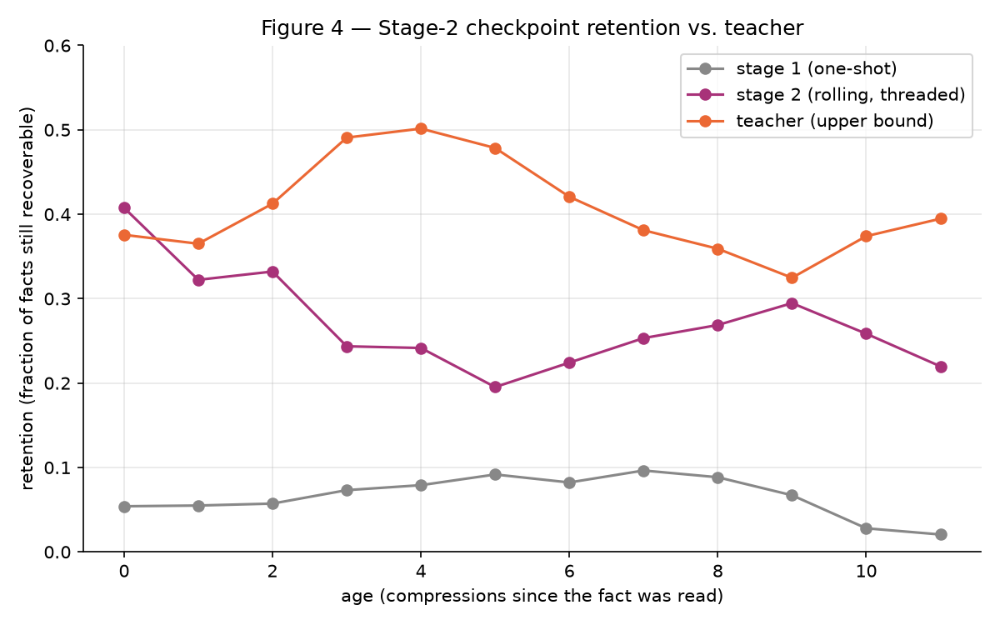
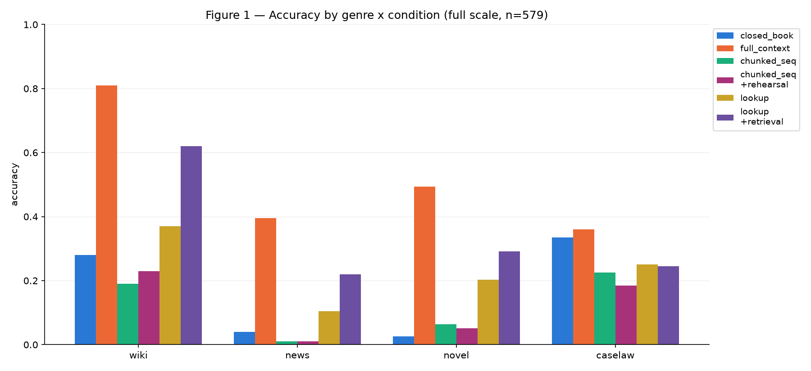
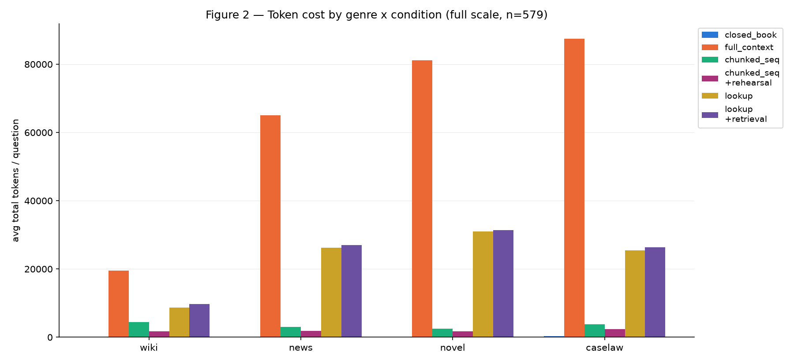
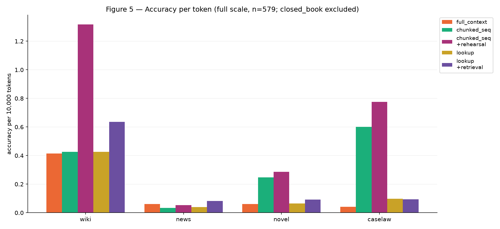
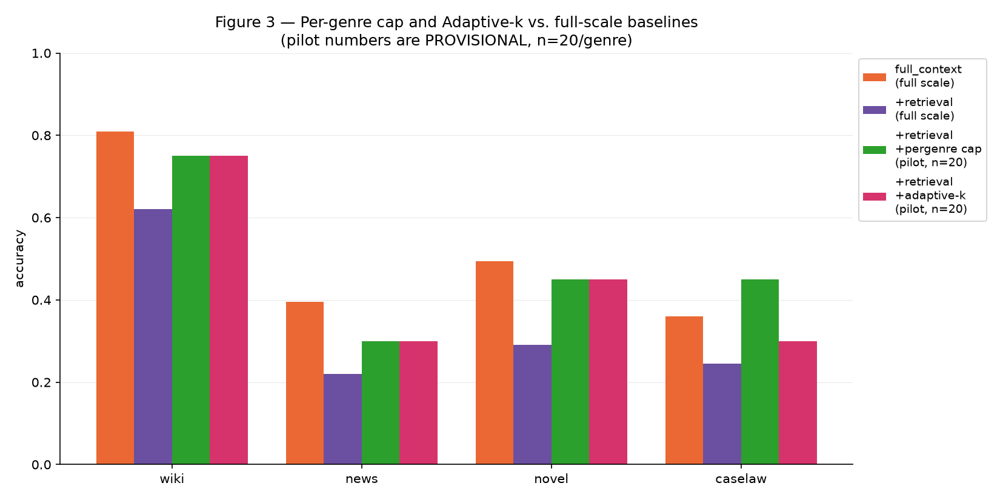

# Rehearse, Then Recall — Progress Report

_Last updated: 2026-08-13 (root cause found: thread-memory collapse explains the rehearsal-vs-RAG gap, confirmed independent of model scale via a controlled minimal test; mnt128 compression-cap relaxation confirmed not to help; anti-collapse corrective-retry mechanism partially works, validation in progress)_

## 1. What this project is testing

Long-context LLM QA under a memory-rehearsal framing, combining two lines of
prior work:

- **C-DIC** (Jung et al., ICML 2026, arXiv:2606.12411) — a retrieve/revise/
  write-back loop over a multi-slot `ThreadMemory`, used here for
  **elaborative rehearsal (B)**: a rolling pass that rewrites each chunk
  while conditioned on related prior material.
- **ReadAgent** (Lee et al., ICML 2024, arXiv:2402.09727) — "shorten, don't
  summarize" gisting, and specifically **ReadAgent-P's interactive lookup**:
  answer from gists if possible, otherwise point at a page/chunk and get its
  raw text for a follow-up call.

The central question this report covers: **can a compressed, gist-based
reading strategy match or beat giving the model the full raw document
(`full_context`), and at what cost?**

## 2. Pipeline summary

1. **Stage 1** (`06`/`07`): B trained one-shot on XSum-style compression.
   Running it in a rolling loop at inference is a known train/inference
   mismatch (C-DIC Table 1) — confirmed here too (see §4).
2. **Stage 2** (`06b`/`07b`): B retrained on rolling-shaped targets, curated
   by a teacher LLM (`meta/llama-3.1-70b-instruct`) driving the same
   `ThreadMemory` loop B uses at inference (`curate_document_threaded`,
   `src/pipeline/teacher.py`). 336 train + 48 val/test documents curated,
   7.1% teacher-call failure rate.
3. **Evaluation** (`10`, `11`): the trained stage-2 checkpoint is used to
   gist 4 eval genres — **wiki**, **news**, **novel** (narrativeqa),
   **caselaw** (CaseHOLD, multiple-choice) — and tested under several
   reading strategies against two baselines from `03`: `closed_book` and
   `full_context`.

## 3. Stage-2 checkpoint quality (`07b`)

`early`/`late` are probe accuracy pooled over ages 0-2 / ages 3+ respectively
(the split the collapse diagnostic actually uses — see
`probe_accuracy_by_position`, `collapse_after=3`); `drop` is early minus late,
so positive means collapse.

| stage-2 checkpoint | early | late | drop |
|---|---|---|---|
| t5-small, self_conditioned_ratio=0.3 (original) | 0.355 | 0.244 | +0.111 |
| t5-small, self_conditioned_ratio=0.0 (ablation) | 0.312 | 0.263 | +0.050 |
| **flan-t5-base, self_conditioned_ratio=0.0** | **0.395** | **0.308** | **+0.088** |
| *(for reference)* stage 1, one-shot driven incrementally | 0.065 | 0.087 | -0.022 |
| *(for reference)* teacher, upper bound | 0.383 | 0.417 | -0.034 |

*(Figure is from the original t5-small run — regenerate from
`results/elaborative_stage2_retention_by_age_flant5base_ratio0.csv` before
using this version in the writeup.)*

Two separate levers were tried, and neither one fully closes the gap to the
teacher on its own:

- **Removing self-conditioning** (`ratio=0.0`) is the more effective lever
  for the *drop* metric specifically — it roughly halves it (+0.111 →
  +0.050), the intended effect of guarding against exposure bias.
- **Scaling the base model** (t5-small → flan-t5-base, still at
  `ratio=0.0`) raises retention at essentially every age in absolute terms
  (early 0.312 → 0.395, late 0.263 → 0.308 — closer to the teacher's 0.383 /
  0.417 than either t5-small config gets) but does **not** stack additively
  with the ratio fix on the drop metric itself (+0.088, worse than +0.050).
  Bigger model, higher ceiling, same-shaped curve.

Every downstream condition in §4 was evaluated against the **t5-small,
ratio=0.0** checkpoint, not the flan-t5-base one — `10`'s
`STAGE2_CHECKPOINT_RATIO0` toggle hasn't been extended to point at the new
checkpoint yet, so §4's numbers still carry that smaller compressor's
ceiling. Whether the flan-t5-base checkpoint's higher absolute retention
translates into higher downstream QA accuracy is an open, unanswered
question, not yet tested.

## 4. Evaluation results

### 4.1 Full-scale, validated (n = 579: wiki 100, news 200, novel 79, caselaw 200)

| condition | wiki | news | novel | caselaw | avg tokens (wiki/news/novel/caselaw) |
|---|---|---|---|---|---|
| closed_book | 0.280 | 0.040 | 0.025 | 0.335 | ~110 (all genres) |
| **full_context** | **0.810** | **0.395** | **0.494** | **0.360** | 19,566 / 65,035 / 81,139 / 87,423 |
| chunked_sequential (raw, 4-chunk budget) | 0.190 | 0.010 | 0.063 | 0.225 | — |
| chunked_sequential_rehearsal (B alone, 4-chunk budget) | 0.230 | 0.010 | 0.051 | 0.185 | — |
| full_context_rehearsal_lookup (gist map + 1-chunk lookup, cap 20) | 0.400 | 0.080 | 0.063 | 0.250 | 8,812 / 25,771 / 31,914 / 25,887 |
| full_context_rehearsal_lookup_retrieval (+ embedding-similarity targeting) | 0.660 | 0.255 | 0.215 | 0.250 | 9,877 / 26,745 / 32,227 / 26,978 |
| **full_context_rehearsal_lookup_adaptive** (Adaptive-k, no per-genre tuning) | **0.760** | **0.255** | 0.177 | **0.300** | 9,738 / 26,962 / 33,252 / 30,625 |

**Reading this table (updated 2026-08-12 with adaptive-k now confirmed at
full scale — previously pilot-only)**: `chunked_sequential_rehearsal` tests
B in a regime where it structurally can't win (same 4-raw-chunk budget as
the uncompressed baseline). The real test starts at
`full_context_rehearsal_lookup`: show every chunk's gist at once, let the
model ask for raw text on 1+ specific chunks. **Adaptive-k is now the best
of the three gist-based conditions overall** (pooled: full_context 0.515,
lookup 0.192, lookup+retrieval 0.318, lookup+adaptive 0.347) and gets
closest to `full_context` on wiki (0.760 vs 0.810, a 0.05 gap) and caselaw
(0.300 vs 0.360) — but **novel is the one genre where retrieval still beats
adaptive** (0.215 vs 0.177), so "adaptive-k wins" is not uniform across
genres. No condition here beats `full_context` outright at full scale.
Token savings are real and large regardless: adaptive-k runs at 50-65%
fewer tokens than `full_context` in every genre (e.g. wiki 9,738 vs 19,566).

*(Note: the lookup/retrieval pooled numbers above differ slightly from an
earlier reading of this table — 0.232/0.344 vs the current 0.192/0.318 —
after a full re-run on 2026-08-12. Same checkpoint, same code; the gap is
consistent with this project's own documented `full_context`
non-reproducibility at temperature=0 (~3.5% row flips on rerun, §2 of `02`).
The numbers above are from the complete, most recent n=579 run.)*

### 4.1.1 Accuracy per token

| genre | full_context | chunked_seq | chunked_seq+rehearsal | lookup | lookup+retrieval | lookup+adaptive |
|---|---|---|---|---|---|---|
| wiki | 0.414 | 0.426 | **1.317** | 0.454 | 0.668 | 0.781 |
| news | 0.061 | 0.033 | 0.054 | 0.031 | 0.095 | **0.095** |
| novel | 0.061 | 0.247 | **0.286** | 0.020 | 0.067 | 0.053 |
| caselaw | 0.041 | 0.600 | **0.775** | 0.097 | 0.093 | 0.098 |

_(accuracy per 10,000 tokens; `closed_book` excluded — near-zero tokens makes its ratio a meaningless outlier)_

**Read this one carefully — it rewards being cheap more than it rewards
being good.** `chunked_seq+rehearsal` tops every genre here, including
caselaw at 0.775, but caselaw's *absolute* accuracy for that condition is
0.185 (§4.1) — worse than `closed_book`'s 0.335, i.e. worse than guessing
from the question alone. A condition that answers badly using very few
tokens still scores well on this metric, because the denominator collapses
faster than the numerator does. Use this figure to compare *among
conditions that already clear a usable accuracy bar* (e.g. `lookup+retrieval`
and `lookup+adaptive` both beat `full_context` on this metric in news,
novel, and caselaw while also being reasonably accurate in absolute
terms) — not as a standalone ranking.

### 4.2 Pilot-scale, provisional (n = 20/genre — **not yet confirmed at full scale**)

Adaptive-k is now confirmed at full scale (§4.1: caselaw 0.300) — kept here
only for the direct pilot-scale comparison against the per-genre cap, which
is still pilot-only:

| condition | wiki | news | novel | caselaw |
|---|---|---|---|---|
| full_context_rehearsal_lookup_retrieval_pergenre (cap 5 for caselaw, 20 elsewhere) | 0.750 | 0.300 | 0.450 | **0.450** |
| full_context_rehearsal_lookup_adaptive (pilot, n=20) | 0.750 | 0.300 | 0.450 | 0.300 |
| full_context_rehearsal_lookup_adaptive (**full scale, n=200, §4.1**) | 0.760 | 0.255 | 0.177 | 0.300 |

The full-scale adaptive-k number landed close to its own pilot on caselaw
(0.300 both) but drifted on news (0.300→0.255) and novel (0.450→0.177) —
another reminder that pilot numbers move at scale, in either direction, not
just downward.

`full_context_with_map` (`11`, full raw text + gist map, single call) —
pilot deltas over `full_context`, pre-shortening-fix, **abandoned, not
directly comparable to the table above** (see §5): wiki +0.140, news
-0.045, novel +0.006, caselaw +0.040.

**Read with real caution.** This project already has one confirmed example
of a pilot-scale result reversing at scale: `full_context_rehearsal_lookup_retrieval`'s
wiki accuracy measured **0.850** (beating `full_context`'s 0.810) at n=20,
then dropped to **0.620** at the full n=100 — noise, not signal. Every
number in this table needs the same full-scale confirmation before it goes
in a paper as a finding rather than a lead.

That said, caselaw's per-genre-cap jump (0.245 -> 0.450 at n=20) is the
largest effect size measured anywhere in this project, and lines up with a
consistent pattern across three separate experiments (the `12` sweep, the
base lookup condition, and this one) that caselaw specifically does worse
with more retrieved context. Worth prioritizing for full-scale
confirmation over the other pending cells.

**Adaptive-k does not match the per-genre cap on caselaw specifically**
(0.300 vs 0.450 at n=20), the one genre the whole per-genre-vs-adaptive
question was actually about. `ADAPTIVE_RELATIVE_THRESHOLD` was swept over
{0.75, 0.85, 0.90, 0.95, 0.98} (n=10/genre/value, 2026-08-11) to check
whether this was simply an untuned default rather than a real mechanism
gap — it wasn't a tuning problem: caselaw stayed at 0.4 across every value
except 0.98 (0.5, on a 1-question swing at n=10 — not distinguishable from
noise), while wiki (0.9) and news (0.1) showed *zero* sensitivity to the
threshold at all. Token cost fell slightly as the threshold tightened
(23,857 → 22,778, mechanical — fewer chunks pass a stricter cutoff), with
no accompanying accuracy gain. Read together with the flat per-genre
numbers, this points at a **targeting-quality gap, not a chunk-count
gap** — the per-genre cap's caselaw advantage likely isn't "fewer chunks,"
it's *which* chunks, something a relative-score-margin rule over the same
similarity ranking can't fix by moving its one threshold. Concluding this
line of tuning here; see §7.

### 4.3 Pure RAG vs. rehearsal — full investigation (confirmed at full scale, n=579)

Every condition in §4.1 compresses first (B's stage-2 rehearsal), whether
or not it also retrieves — nothing in §4.1-4.2 isolates whether the
*rehearsal* step itself is contributing, versus the retrieval half doing
all the work. This section reports a same-day investigation (2026-08-13)
that started as that one missing control and expanded into eight further
conditions once the control's result turned out to be decisive.

#### 4.3.1 `raw_retrieval_adaptive` — the missing control, confirmed

**No rehearsal checkpoint, no teacher, no compression anywhere** — embed
the question, select chunks with the identical Adaptive-k mechanism
`full_context_rehearsal_lookup_adaptive` uses (same threshold, same
embeddings), answer from their **raw** text in one call. The §4.2-era pilot
(n=15/genre) showed this leading on 3 of 4 genres; per this report's own
standing caution about pilot-vs-full-scale reversals (§4.2), that result
was held pending confirmation. It is now confirmed at full scale:

| condition | wiki | news | novel | caselaw | overall | avg tokens |
|---|---|---|---|---|---|---|
| `raw_retrieval_adaptive` (RAG) | **0.850** | **0.420** | **0.316** | **0.300** | **0.439** | 3,588 |
| `full_context_rehearsal_lookup_adaptive` (§4.1's best gist-based condition) | 0.760 | 0.255 | 0.177 | 0.275 | 0.339 | 25,551 |

RAG wins every genre on accuracy and uses 7x fewer tokens. (Caselaw here is
post-`<HOLDING>`-fix, §5 — both rows in this table are on the corrected
corpus.)

#### 4.3.2 Isolating architecture from content

`full_context_rehearsal_lookup_adaptive` always shows the *full document's*
gist map on its first call, whether or not lookup ever triggers — a
structural cost/architecture confound independent of whether rehearsed
*content* helps. `gist_retrieval_adaptive` (`10` §13d) holds RAG's
single-call architecture and chunk selection fixed and swaps only the
content shown (gist instead of raw text):

| condition | wiki | news | novel | caselaw | overall | avg tokens |
|---|---|---|---|---|---|---|
| `gist_retrieval_adaptive` | 0.130 | 0.055 | 0.051 | 0.210 | 0.121 | 1,105 |

Loses to RAG **and** to `full_context_rehearsal_lookup_adaptive` on every
genre. The gist-based lookup condition's partial competitiveness in §4.1
comes from its raw-text lookup escape hatch, not from the gist content
itself — gist content shows no advantage under any architecture tested so
far.

A follow-up, `gist_retrieval_gistembed` (`10` §13e), reselects using
*gist*-embedding similarity instead of raw-text embedding similarity (same
content) to rule out a selection-mismatch confound: overall accuracy is
essentially unchanged (0.121 → 0.119), confirming the loss is about gist
content quality, not which chunks get selected.

A second follow-up, `hybrid_gistselect_rawanswer` (`10` §13f) — select via
gist embeddings, answer from raw text — tests whether gist embeddings are a
*better* retriever even though gist *content* isn't a better answer
source:

| condition | wiki | news | novel | caselaw | overall | avg tokens |
|---|---|---|---|---|---|---|
| `hybrid_gistselect_rawanswer` | 0.480 | 0.175 | 0.152 | 0.295 | 0.266 | 5,364 |

Loses to RAG on **both** accuracy and tokens — gist embeddings are a worse
retriever than raw-text embeddings, not a better one.

#### 4.3.3 Teacher-gist ceiling test → thread-memory collapse, confirmed root cause

To test whether t5-small's compressor quality (not compression as such) is
the bottleneck, `meta/llama-3.1-70b-instruct` was run through the identical
thread-retrieve-replace mechanism (`curate_document_threaded`) that built
every gist above, on a 30-chunks-per-genre prefix pilot:

| genre | raw→gist word ratio | failed positions |
|---|---|---|
| wiki | 4,137 → 7,959 (**192%**) | 5/30 |
| novel | 4,123 → 6,096 (**148%**) | 0/30 |
| news | 3,829 → 2,597 (68%) | 0/30 |
| caselaw | 4,172 → 2,871 (69%) | 0/30 |

Wiki and novel *expanded* rather than compressed. Inspecting all 6 gists
for wiki side by side (not just one, as the initial spot-check did) showed
they were **near-identical** — chunks covering boroughs, founding history,
tourism, Wall Street, and glacial geology all produced essentially the same
sentence as chunk 0's intro. This is not "topic drift" on one example; it
is total collapse. The same pattern was independently confirmed in the
*student*'s own output: `full_gists_by_genre_flant5base.json` (the
precomputed, already-on-disk gists used throughout this project's earlier
evaluation) shows the identical pattern for wiki, news, novel, and case
law alike — every chunk's gist beyond position 0 reproduces position 0's
content almost verbatim, regardless of genre.

**Controlled minimal test isolates the cause.** Calling the student
(t5-small) and the teacher (70B) directly with two topically distinct
sentences alternately placed in the "current chunk" and "related thread"
slots of their respective prompts: both models reproduced whichever
content sat in the "related thread" slot near-verbatim and ignored
"current chunk" entirely — regardless of which actual content occupied
which slot (confirmed by swapping them). This rules out both a code bug
(the prompt-building and write-back logic in `rehearsal.py`/
`thread_memory.py` were independently inspected and are correct — they
faithfully pass whatever text the model returns into memory) and a
positional artifact (the student's prompt puts "current chunk" first,
the teacher's puts "related thread" first, yet both collapse toward the
"related thread" slot specifically).

**Root cause: the student learned this from the teacher.** The Stage-2
training target ($S_i$ in Eq. 3, §2.2.2 methodology) *is* the teacher's
`curate_document_threaded` output — and that output was already collapsed,
per the finding above. The student was never trained on clean rolling
summaries; it was trained on a large volume of examples whose "correct"
answer, whenever a related thread existed, was essentially "reproduce the
thread." Supervised training on that signal produces exactly what was
observed. **Retraining the student would not fix this** — the flaw is
upstream, in what `curate_document_threaded` produces, which flows into
`06b`'s corpus of training pairs. This also revises §3's earlier
"compressor scale / training data volume" explanation for Table 2's
residual gap (§3): scaling the compressor (flan-t5-base, §3) raised
absolute retention without improving the age-related *decay* itself,
which is now legible as the same collapse pattern degrading a bigger
model too, not a capacity-gap symptom curable by more parameters or more
documents.

**Mitigation attempt (2026-08-13, in progress).** A collapse check
(`collapse_score` — token-F1 overlap between a regenerated gist and its
given context) plus corrective retry was added
(`curate_document_threaded_anticollapse`, `src/pipeline/teacher.py`): on
detecting collapse, retry up to twice with explicit corrective feedback,
then regenerate with no context at all (treating the chunk as opening a
fresh thread) if still collapsed. A 6-chunk sequential trial found the
corrective retries **never succeeded** (0/10 across 5 context-bearing
chunks) — every case that resolved did so via the no-context fallback,
meaning the final gists are now accurate per-chunk but the mechanism is
functionally closer to independent per-chunk summarization than genuine
cross-chunk thread integration. A 20-chunk, retry-skipped re-run
(`max_retries=0`, since retries never helped) is in progress to confirm
this holds at slightly larger scale before deciding whether to pursue a
full corpus re-curation. Full-scale teacher re-curation (real API cost;
~1,395 chunks, ~2.9h at the configured rate limit even before any retry
overhead) has not been run.

#### 4.3.4 Why: literature grounding (2026-08-13)

- **RAPTOR** (Sarthi et al., ICLR 2024) — a hierarchical tree of
  progressively more abstract summaries, with retrieval choosing which
  *level* fits a given query; +20pp on QuALITY. Every gist condition tested
  here forces one uniform compression level regardless of question.
- **EXIT** (Kim et al., ACL 2025 Findings, arXiv:2412.12559) — extractive
  compression (selecting existing sentences) beats abstractive
  summarization for RAG (EM 41.4 vs. 36.9), matching §4.3.3's directly
  observed failure mode (exact terms dropped, content rewritten).
- **LongLLMLingua / SmartChunk-style compression** — query-*aware*
  compression (done after the question is known) beats query-agnostic
  compression. B's design is query-agnostic by construction (the rehearsal
  step never sees the eventual question) — unfavorable on this axis too.

Both axes point the same direction: gist_retrieval's loss is not "lossy
compression can't work here," but that this project's specific compression
choice (abstractive, query-agnostic) sits on the disadvantaged side of two
axes the 2025 literature has already characterized.

#### 4.3.5 A condition built on that literature: extractive, query-aware pruning

`extractive_query_aware_adaptive` (`10` §13g) holds RAG's chunk selection
fixed, then — *after* the question is known — scores individual sentences
within the selected chunks against the question and keeps only the
highest-scoring ones, verbatim (no rewriting):

| condition | wiki | news | novel | caselaw | overall | avg tokens | avg latency |
|---|---|---|---|---|---|---|---|
| RAG (`raw_retrieval_adaptive`) | 0.850 | 0.420 | 0.316 | 0.300 | 0.439 | 3,588 | 4.75s |
| `extractive_query_aware_adaptive` | 0.780 | 0.370 | **0.114** | 0.255 | 0.366 | **680** | **3.17s** |

This is the first condition in this investigation with a genuine,
defensible trade-off rather than a strict loss: **5.3x fewer tokens, ~34%
lower latency, for a 7.3pp accuracy cost** — within 5-7pp of RAG on 3 of 4
genres. Accuracy-per-10k-tokens: 5.38 vs. RAG's 1.22 (4.4x). The exception
is novel, which drops sharply (-20.2pp) — plausibly because narrative
continuity depends on surrounding sentences that isolated extractive
pruning discards. Not yet investigated: a sentence-window variant (±1
sentence around each selected one) that might recover novel's loss without
giving up the token/latency advantage.

#### 4.3.6 Length-stress test — does document length change the calculus?

Motivated by 2026-era context-window reality: advertised windows are large
(Claude/GPT 1M tokens, Gemini 2-10M), but usable reliability is not —
NVIDIA's RULER puts effective capacity at 50-65% of advertised, and Adobe's
NoLiMa (2025) found most models score below half their short-context
accuracy past **32K tokens**. `full_context_rehearsal_lookup_adaptive`'s
own token usage (26K-33K/question in 3 of 4 genres, §4.1) already sits at
that threshold — raising the question of whether a longer-document regime
would favor compression (bounded size) over RAG (unbounded selection size)
by construction.

Tested with `01_length_stress_prep.ipynb`'s per-document truncation ladder
(1,000-10,000 words, pilot range of a 50,000-word ladder) via a standalone
script (`length_stress_rag_vs_gist.py`): at every tested length, RAG's
*selected* (retrieved) token budget stays small and grows slowly (338 →
826 tokens, 1K→10K words) because Adaptive-k selects a roughly constant
number of relevant chunks regardless of total document length. Gist size,
by contrast, scales with the *whole document* (every chunk gets gisted,
selectively or not) and grows far faster — already exceeding RAG's budget
at the shortest tested rung, even at the tightest compression setting
(`max_new_tokens=64`: 704 tokens at 1,000 words vs. RAG's 338; the gap
widens with length). Loosening the compression cap (128/256 tokens) makes
this worse, not better. **The length-stress hypothesis does not hold in the
tested range — if anything it reverses**: RAG's relevance-gated retrieval
scales sub-linearly with corpus size; query-agnostic whole-document
compression scales linearly with it. A separate finding from the same
script: RAG's own recall (whether Adaptive-k selects the chunk actually
containing the evidence) degrades sharply with length (0.6 at 1K words →
0.1 at 10K) — a real problem, but one for RAG's own tuning, not evidence
that compression fixes it (accuracy at length was not measured for either
approach — only token/size proxies).

#### 4.3.7 Does less-aggressive compression recover accuracy? No — confirmed, rejected

`gist_retrieval_adaptive_mnt128` (`10` §13h) tests a narrower question than
§4.3.6: at nb10's actual eval scale (not the length-stress ladder's single
long documents), does regenerating the gist with `max_new_tokens=128`
instead of 64 (the student's inference cap vs. the 512 its teacher targets
were built with — a real train/inference mismatch, not evidence 64 is
optimal) recover some of §4.3.2's accuracy loss without costing much more
than its 1,105 avg tokens?

**No — it makes both axes worse.** Pilot (n=20/genre, same slice as
`gist_retrieval_adaptive`'s mnt=64 baseline for a matched comparison):

| genre | mnt=64 | mnt=128 |
|---|---|---|
| caselaw | 0.35 | 0.30 |
| news | 0.05 | 0.05 |
| novel | 0.15 | 0.10 |
| wiki | 0.30 | **0.00** |
| overall | 0.212 | 0.112 |
| avg tokens | 902 | 1,539 |

Accuracy nearly halves and tokens grow 1.7x. Consistent with §4.3.3: the
problem is not that 64 tokens is too little room to fit the *right*
content — it's that the collapse mechanism produces the *wrong* content
regardless of how much room it's given, so a bigger budget only lets it
reproduce more of the wrong (collapsed) thing.

#### Summary

| condition | overall accuracy | avg tokens | vs. RAG |
|---|---|---|---|
| `raw_retrieval_adaptive` (RAG) | 0.439 | 3,588 | — |
| `full_context_rehearsal_lookup_adaptive` (best §4.1 gist condition) | 0.339 | 25,551 | loses accuracy, 7x the tokens |
| `gist_retrieval_adaptive` | 0.121 | 1,105 | loses badly on every genre |
| `gist_retrieval_gistembed` | 0.119 | ~1,100 | confirms selection wasn't the issue |
| `hybrid_gistselect_rawanswer` | 0.266 | 5,364 | loses accuracy *and* tokens |
| `extractive_query_aware_adaptive` | 0.366 | **680** | close accuracy (3/4 genres), 5.3x fewer tokens |
| `gist_retrieval_adaptive_mnt128` | 0.112 (pilot) | 1,539 (pilot) | worse on both axes |

**Current honest read**: no condition built on compressed (gisted) content
beats RAG on accuracy, at any tested compression aggressiveness, model
size, or selection mechanism — and §4.3.3 now explains why with a
specific, identified mechanism (thread-memory collapse) rather than a
general "compression is hard" appeal. The one condition with a genuine,
defensible advantage keeps RAG's raw-text answer source and prunes it
*extractively* and *query-aware*, not by compressing it in advance — this
narrows what "rehearsal" can honestly claim credit for in this project to
a cost/latency argument, not an accuracy one.

## 5. Methodology notes worth keeping

- **A real bug was found and fixed in the lookup mechanism.** The
  second-call ("show raw text, answer again") step originally reused the
  first call's full message history, which resent the entire per-chunk
  gist block (tens of thousands of tokens) a second time — burying the one
  useful addition (raw text) behind duplicate noise. Measured effect:
  accuracy on lookup-triggered questions was 0.0-0.30 pre-fix, *below* both
  `full_context` and the non-triggered path — i.e., asking for help made
  answers worse. Fixed by making the second call a fresh, short prompt
  (system + raw text + question only). See `10` §8-9 for the full account.
- **Per-genre tuning was tried, worked, and was deliberately abandoned** in
  favor of Adaptive-k (arXiv:2506.08479) — a hardcoded `{genre: cap}` table
  doesn't generalize to a genre outside the 4 tested. The adaptive version
  replaces every fixed-count expansion signal (position window, embedding
  top-K, per-genre cap) with one mechanism: keep whichever chunks score
  within a relative margin of the top similarity score for *this*
  question, decided from the score distribution's own shape, not a lookup
  table.
- **`full_context_with_map` (`11`) was explored and set aside on cost
  grounds**, not accuracy grounds — it showed a real pilot-scale win in 3 of
  4 genres, but is structurally more expensive than `full_context` itself
  (full raw text + a gist map, every call), which conflicts with this
  project's efficiency framing. Not deleted — kept as a documented
  alternative for a cost-insensitive setting.
- **Fixed (2026-08-12): the CaseHOLD *eval* corpus's `<HOLDING>` artifact.**
  Previously only the *train* corpora were stripped (`06b`); the eval
  corpus was flagged but left unfixed. Verified the exact removal pattern
  (`r" ?\(<HOLDING>\)"`) against 20 train corpora before/after backups
  (17/20 exact match; the other 3 differ only at a document-separator
  edge case that doesn't occur in the eval file), applied it to
  `caselaw_eval_corpus.txt` (395 occurrences removed, 4,733 chars), and
  recomputed every question's `evidence_char_pos`/`evidence_word_pos` in
  `caselaw_eval_questions.csv` by tracking exactly how much text was
  removed before each position — not re-deriving it from excerpt
  boundaries. All 200 questions validated to land exactly at a document
  separator post-strip; a spot-check of 4 questions across the corpus
  confirmed identical surrounding text at the shifted position. Old
  positions kept as `evidence_char_pos_old`/`evidence_word_pos_old` for
  audit. **Caselaw was re-evaluated on all three lookup conditions
  post-fix — accuracy barely moved anywhere**
  (`lookup` 0.250→0.255, `+retrieval` 0.250→0.235,
  `+adaptive` 0.300→0.275, all within noise) **— the `<HOLDING>` artifact
  does not explain caselaw's "more retrieved context hurts" anomaly
  (§4.2).** All three re-evaluations are complete as of 2026-08-13; §4.1's
  and §4.3's tables use the corrected corpus throughout.

## 6. Scope: B + C only (A dropped, 2026-08-12)

Per the experimental design doc's full grid (strategy {A maintenance, B
elaborative, A->B} x testing-effect {no-C, +C} x lookup {no, yes}, 2
baselines + 12 intervention cells x 4 genres): only **B**, with and without
lookup variants, has been fully tested (§4). **A (maintenance rehearsal)
and A→B are explicitly out of scope as of 2026-08-12** — a deliberate
decision, not a not-yet-built gap; `04`/`05` (A's prep/train notebooks)
will not be run. The lookup mechanism itself is written strategy-agnostic
(`_lookup_window_indices` / the adaptive selection don't assume B
specifically), so this was a scope choice, not a technical blocker.

**C (testing effect) — implemented and piloted at n=25, reverses the n=1 signal.**
The original design trained a standalone QG model (`08`/`09`, SQuAD
reverse-QA) to generate self-test questions. As actually implemented
(`06c_testing_effect_stage2_prep.ipynb`, `src/pipeline/teacher.py`'s
`curate_document_threaded_with_testing`), C instead reuses the real
evidence-linked questions `06b`'s curation already has (`answers_by_chunk`)
as the in-loop test material, folded directly into stage-2 curation as a
probe → corrective-retry → verbatim-fallback loop — grounded in Roediger &
Karpicke (2006) and Karpicke & Roediger (2008)'s testing-effect literature,
not a synthesized-question approach. `08`/`09` are effectively superseded
by this approach.

A single-document pilot (news, 12 chunks) initially looked strong: drop
went from +0.040 (plain) to -0.005 (with testing). **That reversed at
n=25 (7 news, 6 caselaw, 6 narrativeqa, 6 wiki), same documents both ways:**

| | early | late | drop |
|---|---|---|---|
| plain curation (`06b`) | 0.387 | 0.458 | **-0.071** (no collapse) |
| **testing-effect curation** | **0.863** | 0.676 | **+0.186** (collapse) |

The mechanism clearly *does* something — of 142 tested chunks, only 21.1%
passed their probe on the first try; 64.8% passed after a corrective retry
(133 retry calls spent), 14.1% exhausted retries and fell back to verbatim.
That effort buys much higher **absolute** retention early (0.863 vs 0.387)
but a **steeper decline** with age than plain curation shows — the opposite
of the intended effect on the metric this project actually cares about.
Read together, this looks like the corrective-retry loop optimizing each
gist for *passing its own probe right now* at some cost to how well that
gist survives being read again several revisions later — a plausible
cognitive-science parallel is cramming: strong immediate recall, weaker
durability. This project has one prior confirmed case of a pilot number
reversing at scale (§4.2's wiki `lookup+retrieval`, n=20→n=100); this is a
second, at 12 chunks→25 documents. **Treat the n=25 numbers as the current
best estimate, not final** — not yet run at `06b`'s full 336-document
scale.

## 7. Status (updated 2026-08-13)

- **Headline: pure RAG (no rehearsal, no teacher, no compression) beats
  every rehearsal-family condition on every genre**, confirmed at full
  scale (n=579) — 0.439 overall accuracy vs. 0.339 for the best gist-based
  condition, at 7x fewer tokens. See §4.3.1.
- **The loss is content, not architecture, not selection, and confirmed not
  model size — root cause identified: thread-memory collapse** (§4.3.2-3):
  swapping only the content shown (gist vs. raw) at RAG's own single-call
  architecture loses on every genre; reselecting via gist embeddings
  instead of raw-text embeddings changes almost nothing; answering from
  raw text after selecting via gist embeddings loses on both accuracy and
  tokens. A 70B teacher run through the identical thread-retrieve-replace
  mechanism collapses the same way the student does — not on one
  cherry-picked example but systematically (all 6 chunks checked side by
  side for one genre converge on near-identical text). A controlled
  minimal test with the "current chunk"/"related thread" fields swapped
  confirms both model sizes reproduce whichever content sits in "related
  thread" and ignore "current chunk," regardless of which actual content
  occupies which slot. Since the student's training target *is* the
  teacher's (already-collapsed) output, the student learned this failure
  faithfully from its training data — retraining it will not fix this;
  the flaw is upstream, in teacher curation.
- **2025 literature (RAPTOR, EXIT, LongLLMLingua) explains why** (§4.3.4):
  this project's B is abstractive and query-agnostic by design — both
  properties the literature already documents as disadvantaged relative to
  extractive, query-aware alternatives for this kind of task.
- **One condition shows a genuine, defensible advantage**:
  `extractive_query_aware_adaptive` (§4.3.5) — RAG's own chunk selection,
  pruned to query-relevant sentences *after* the question is known, kept
  verbatim. 5.3x fewer tokens and lower latency than RAG for a 7.3pp
  accuracy cost, competitive within 5-7pp on 3 of 4 genres; novel is a
  clear remaining weak point.
- **Length-stress test rules out the context-window-relief hypothesis in
  the tested range** (§4.3.6) — gist size scales with whole-document
  length; RAG's retrieved-token budget scales with relevant content only,
  which stays roughly flat regardless of corpus size. The hypothesized
  advantage for compression at longer documents did not appear at
  1,000-10,000 words; if anything it reverses.
- **Relaxing the compression cap does not recover accuracy — confirmed,
  rejected** (§4.3.7): `gist_retrieval_adaptive_mnt128` (64→128 tokens)
  scored *worse* on both accuracy (0.212→0.112) and tokens (902→1,539) at
  nb10's actual eval scale. Consistent with the collapse diagnosis above —
  more budget just lets the mechanism reproduce more of the wrong content.
- **Anti-collapse mitigation: partial, still being validated**
  (`curate_document_threaded_anticollapse`, §4.3.3) — a collapse-detection
  + corrective-retry loop was built; in a 6-chunk trial, the corrective
  retries themselves never succeeded (0/10), but a final no-context
  fallback did recover accurate per-chunk content every time. This fixes
  *correctness* but likely gives up genuine cross-chunk integration in the
  process. A 20-chunk, retry-skipped re-run is in progress to confirm this
  holds before deciding whether a full corpus re-curation is worth the
  cost.
- **Adaptive-k vs. per-genre cap on caselaw** (§4.2): tuning
  `ADAPTIVE_RELATIVE_THRESHOLD` did not close the gap — a targeting-quality
  limitation, not a chunk-count one.
- **Bigger compressor (flan-t5-base)**: raised absolute retention but not
  downstream QA accuracy in a pilot (§3). Reported negative result, not
  pursued further.
- **C (testing effect)**: implemented, piloted at n=25 across all 4
  genres (§6) — trades higher early retention for steeper age-related
  decline versus plain curation. Real finding, not yet run at full scale;
  deprioritized behind §4.3's investigation.
- **`<HOLDING>` eval-corpus artifact — fixed and fully checked (§5)**: all
  three lookup conditions re-evaluated post-fix, accuracy moved <0.03
  everywhere — the artifact does not explain caselaw's "more context
  hurts" pattern.
- **Not yet run to full scale**: the anti-collapse mechanism's full-corpus
  validation (§4.3.3, pending the 20-chunk check above), the teacher-gist
  ceiling test with a *working* (non-collapsing) curation mechanism (real
  API cost, ~2.9h+ estimated, more with retry overhead), and testing-effect's
  full 336-document curation (§6) — all legitimate follow-ups.
