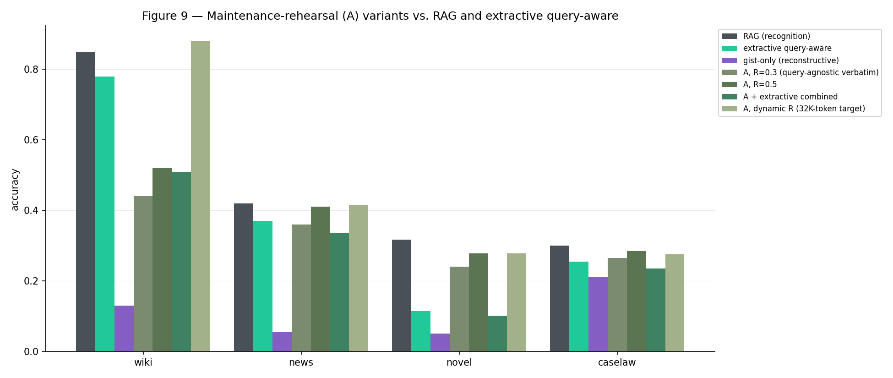
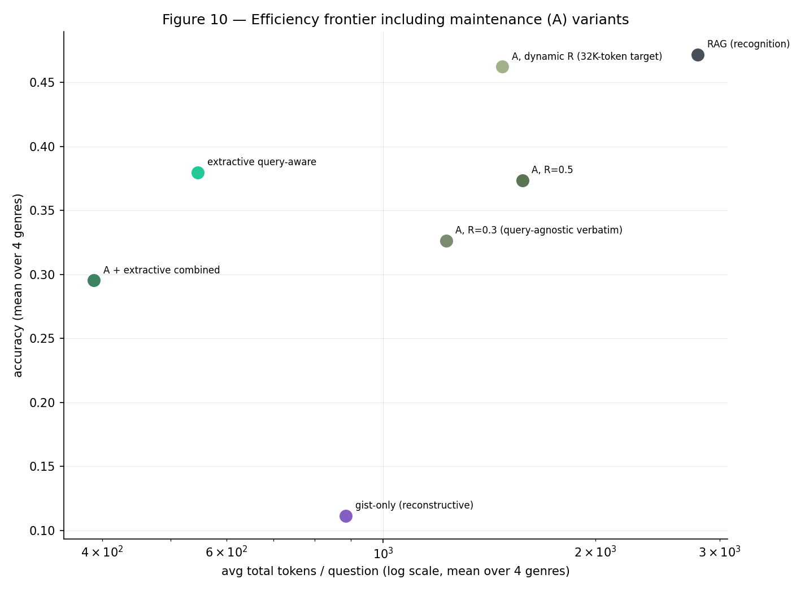
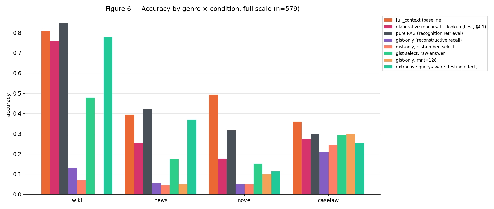
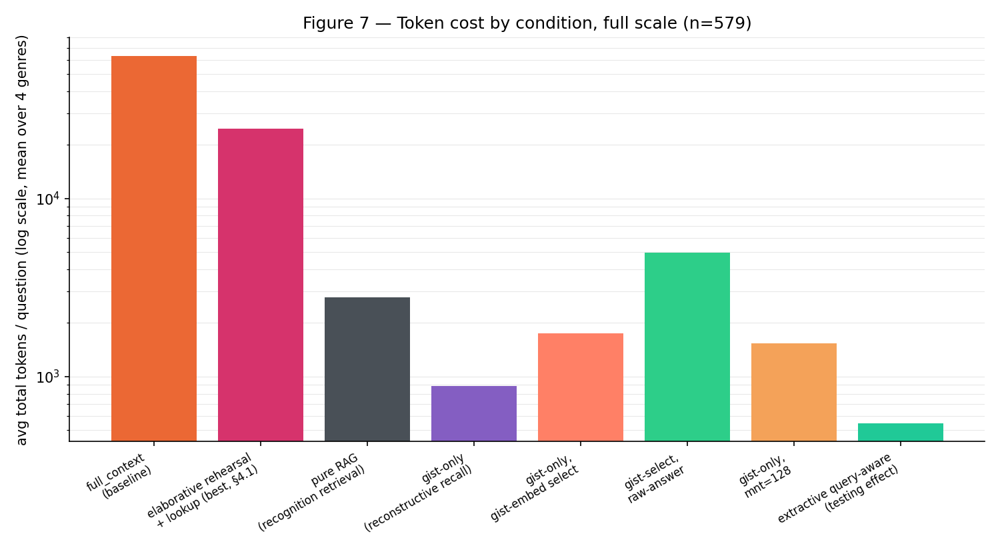
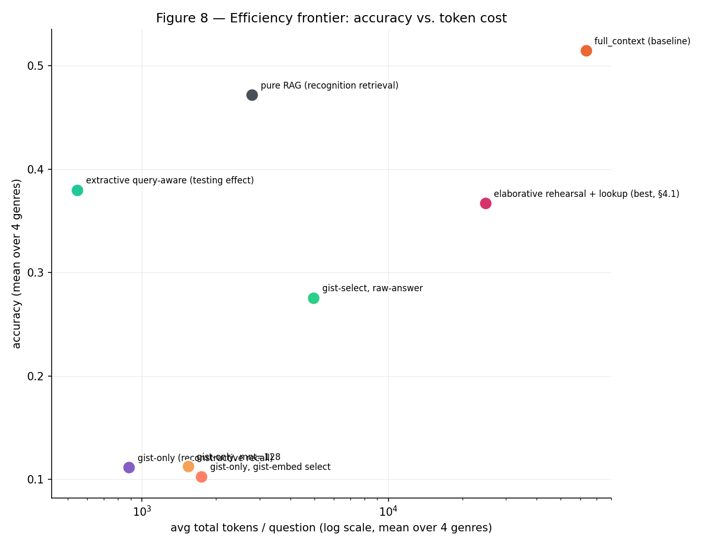

# Fit Over Depth: Transfer-Appropriate Compression for Long-Context LLM QA
### (Analysis Report — repo: `fit-over-depth`, formerly `rehearse-then-recall`)

_Last updated: 2026-08-19 — short paper, presentation deck, and speaker
script all finalized (4 figures, 5 tables); repo renamed
`rehearse-then-recall` → `fit-over-depth` to match. Structured around a
two-layer framing — Layer 1
(§6): why rewriting-based rehearsal collapses regardless of model scale;
Layer 2 (§7): why, among strategies that don't rewrite, the winner depends
on fit (Transfer-Appropriate Processing) rather than depth. §7.6 proposes
the paper's headline result: a purely extractive pipeline (document-length-
adaptive compression + genre-selective local coherence repair) that matches
RAG's accuracy exactly (254/579) at fewer tokens on every genre. The
project's original working title ("Rehearse, Then Recall") is retired — it
centers elaborative rehearsal, which Layer 1 rejects._

## 0. One-paragraph summary

Applying human memory-consolidation strategies to a long-context LLM QA
pipeline splits into two separable questions, and conflating them is why
prior work in this space reports inconsistent results. **Does the strategy
work at all?** — decided by whether it *rewrites* content or *preserves* it:
every mechanism that regenerates text (elaborative rehearsal's rolling merge,
`ThreadMemory`'s revise branch) collapses toward near-duplicate output
regardless of model scale (Layer 1, §6). **Given that it works, which
strategy wins?** — decided not by a universal depth hierarchy but by whether
the strategy's selection *grain* (sentence vs. chunk) and *criterion*
(query-similarity vs. general importance) fit the document's length and its
dependence on narrative continuity (Layer 2, §7) — Transfer-Appropriate
Processing (Morris, Bransford & Franks, 1977) rather than Craik & Lockhart's
(1972) depth-of-processing hierarchy. Two extractive strategies —
query-aware sentence pruning (the testing-effect analog) and
document-length-adaptive verbatim selection (the maintenance-rehearsal
analog) — both survive Layer 1, and between them they match or beat pure RAG
on every genre tested at a fraction of the tokens. **Proposed final model
(§7.6)**: the maintenance-rehearsal analog, repaired with local context
padding exactly where a genre's comprehension depends on situational
continuity (predicted, not fit, from Kintsch's 1988 bridging-inference
account and the event-indexing model of narrative comprehension), matches
RAG's overall accuracy exactly (254/579) at fewer tokens on every genre —
while never regenerating a single sentence.

## 1. Research questions

- **RQ1** (unchanged): does applying a human memory-consolidation strategy to
  a long-context LLM pipeline improve information use over giving the model
  the full raw document?
- **RQ2** (redefined 2026-08-14 — was "does elaborative rehearsal's gist
  help", rejected outright): is there one human memory strategy that's
  universally best, or does it depend on the content and document structure?
  Splits into:
  - **RQ2a — does it work at all?** Determined by whether the strategy
    *rewrites* content or *preserves* it (Layer 1, §6).
  - **RQ2b — given that it works, which is better?** Determined by whether
    the strategy's encoding grain and criterion fit the document's structure
    (Layer 2, §7).

This report combines two lines of prior work: **C-DIC** (Jung et al., ICML
2026 under review — currently listed on OpenReview as ICLR 2026, title
slightly different in review, *verify before citing in the paper*,
arXiv:2606.12411), a retrieve/revise/write-back loop over a multi-slot
`ThreadMemory`, used here for **elaborative rehearsal (B)**; and
**ReadAgent** (Lee et al., ICML 2024, arXiv:2402.09727), "shorten, don't
summarize" gisting and ReadAgent-P's interactive lookup.

## 2. Pipeline summary

1. **Stage 1** (`06`/`07`): B trained one-shot on XSum-style compression.
   Running it in a rolling loop at inference is a known train/inference
   mismatch (C-DIC Table 1) — confirmed here too (§3).
2. **Stage 2** (`06b`/`07b`): B retrained on rolling-shaped targets, curated
   by a teacher LLM (`meta/llama-3.1-70b-instruct`) driving the same
   `ThreadMemory` loop B uses at inference (`curate_document_threaded`,
   `src/pipeline/teacher.py`). 336 train + 48 val/test documents curated,
   7.1% teacher-call failure rate.
3. **Evaluation** (`10`, `11`): the trained stage-2 checkpoint gists 4 eval
   genres — **wiki**, **news**, **novel** (narrativeqa), **caselaw**
   (CaseHOLD, multiple-choice) — tested under several reading strategies
   against two baselines from `03`: `closed_book` and `full_context`.

## 3. Stage-2 checkpoint quality (`07b`)

`early`/`late` are probe accuracy pooled over ages 0-2 / ages 3+
(`probe_accuracy_by_position`, `collapse_after=3`); `drop` = early − late,
so positive means collapse.

| stage-2 checkpoint | early | late | drop |
|---|---|---|---|
| t5-small, self_conditioned_ratio=0.3 (original) | 0.355 | 0.244 | +0.111 |
| t5-small, self_conditioned_ratio=0.0 (ablation) | 0.312 | 0.263 | +0.050 |
| **flan-t5-base, self_conditioned_ratio=0.0** | **0.395** | **0.308** | **+0.088** |
| *(reference)* stage 1, one-shot driven incrementally | 0.065 | 0.087 | −0.022 |
| *(reference)* teacher, upper bound | 0.383 | 0.417 | −0.034 |

Removing self-conditioning roughly halves the drop (+0.111→+0.050); scaling
the compressor (t5-small→flan-t5-base) raises absolute retention at every
age but doesn't stack with the ratio fix on the drop metric itself
(+0.088). Every condition in §6-§7 uses the **t5-small, ratio=0.0**
checkpoint — `10`'s `STAGE2_CHECKPOINT_RATIO0` toggle was never extended to
the flan-t5-base checkpoint, so whether the bigger compressor's higher
retention would move downstream QA accuracy is untested.

## 4. Document structure across the four eval genres

Layer 2 (§7) turns on whether a strategy's encoding fits the document. This
table makes that variable explicit — assembled here from figures already on
record (`full_context`'s own average token count, §6.1) rather than measured
fresh:

| genre | doc length (avg `full_context` tokens) | narrative continuity | question source |
|---|---|---|---|
| wiki | ~19,566 (shortest) | low — encyclopedic, independent facts | factual QA over article text |
| news | ~65,035 | low | factual QA over article text |
| **novel** (narrativeqa) | ~81,139 | **high — the only continuity-dependent genre tested** | written from a **plot summary**, not the source text |
| caselaw (CaseHOLD) | ~87,423 (longest) | low — structured/formal legal text | 5-way multiple choice over holding statements |

Two structural facts drive most of §7's genre pattern: **wiki is short
enough that a 32K-token compression target barely compresses it at all**
(§7.3's dynamic ratio lands near R≈1), and **novel is the one genre whose
questions were authored from a summary of the plot, not the source prose**
— which plausibly explains why an *importance*-based criterion (what
matters to the plot) fits its retrieval demands better than a
*query-similarity* criterion tuned for locating a literal answer span (§7.5).

## 5. Baselines and the RAG control

| condition | wiki | news | novel | caselaw | avg tokens |
|---|---|---|---|---|---|
| `closed_book` (semantic memory alone) | 0.280 | 0.040 | 0.025 | 0.335 | ~110 |
| `full_context` (unbounded working memory, oracle) | 0.810 | 0.395 | 0.494 | 0.360 | 19,566–87,423 |
| `raw_retrieval_adaptive` (RAG) | **0.850** | **0.420** | **0.316** | **0.300** | **3,588** |

`raw_retrieval_adaptive` — embed the question, select chunks via Adaptive-k
(relative-margin cutoff on cosine similarity, no fixed count), answer from
their **raw** text — was not in the original design; it was added once an
early gist-based result looked implausibly good and the missing no-rehearsal
control became obvious. Confirmed at full scale (n=579) after an earlier
pilot (n=15/genre) had shown the same lead on 3 of 4 genres, consistent with
this project's standing caution about pilot-scale reversals (§8). **This is
the project's headline reference point for both layers below**: it beats
every generative rehearsal condition tested (Layer 1), and it's the target
the surviving extractive strategies are measured against (Layer 2).

## 6. Layer 1 — Why rewriting fails: thread-memory collapse

**What this layer establishes**: content that gets *regenerated* — merged
with retrieved context and rewritten by a model — collapses toward
near-duplicate output, independent of model scale, selection mechanism, or
compression budget. This is a precondition for Layer 2: a strategy has to
clear this bar before "which is better" is even a meaningful question.

### 6.1 The gist-based lookup family (full scale, n=579)

| condition | wiki | news | novel | caselaw | avg tokens |
|---|---|---|---|---|---|
| `chunked_sequential` (raw, 4-chunk budget) | 0.190 | 0.010 | 0.063 | 0.225 | — |
| `chunked_sequential_rehearsal` (B, same 4-chunk budget) | 0.230 | 0.010 | 0.051 | 0.185 | — |
| `full_context_rehearsal_lookup` (gist map + lookup, cap 20) | 0.400 | 0.080 | 0.063 | 0.250 | 8,812–31,914 |
| `full_context_rehearsal_lookup_retrieval` (+ similarity targeting) | 0.660 | 0.255 | 0.215 | 0.250 | 9,877–32,227 |
| `full_context_rehearsal_lookup_adaptive` (Adaptive-k) | 0.760 | 0.255 | 0.177 | 0.300 | 9,738–33,252 |

`chunked_sequential[_rehearsal]` share a 4-raw-chunk budget with the
uncompressed baseline — a floor, not a real test of B. The real test starts
at `full_context_rehearsal_lookup`: show every chunk's gist, let the model
ask for raw text on specific chunks. Adaptive-k is the best of the three
(pooled overall 0.339 vs. lookup's 0.192 and lookup+retrieval's 0.318),
closest to `full_context` on wiki (0.760 vs. 0.810) and caselaw (0.300 vs.
0.360) — but similarity-only retrieval still beats it on novel (0.215 vs.
0.177). No condition here beats `full_context`, and — the point this layer
exists to explain — none of them beat RAG either (§5): 0.339 overall at
25,551 avg tokens vs. RAG's 0.439 at 3,588.

*Accuracy-per-token is a trap here, not a ranking*:
`chunked_sequential_rehearsal` tops the accuracy-per-10k-tokens metric on
caselaw (0.775) with an *absolute* accuracy of 0.185 — worse than guessing
from the question alone (`closed_book`, 0.335). Read efficiency numbers only
alongside absolute accuracy.

### 6.2 Isolating architecture from content

`full_context_rehearsal_lookup_adaptive` always shows the full document's
gist map, whether or not lookup triggers — a cost/architecture confound
independent of whether the gisted *content* itself is the problem.
`gist_retrieval_adaptive` (`10` §13d) holds RAG's single-call architecture
and chunk selection fixed and swaps only the content shown (gist instead of
raw text):

| condition | wiki | news | novel | caselaw | overall | avg tokens |
|---|---|---|---|---|---|---|
| `gist_retrieval_adaptive` | 0.130 | 0.055 | 0.051 | 0.210 | **0.121** | 1,105 |

Loses to RAG **and** to the lookup family on every genre — the gist-based
lookup condition's partial competitiveness in §6.1 comes entirely from its
raw-text lookup escape hatch, not the gist content.

Two follow-up controls rule out selection as the cause:
`gist_retrieval_gistembed` (`10` §13e) reselects via gist-embedding
similarity instead of raw-text similarity (same gisted content) — overall
accuracy is essentially unchanged (0.121→0.119), so the loss isn't about
which chunks get picked. `hybrid_gistselect_rawanswer` (`10` §13f) — select
via gist embeddings, answer from raw text — tests whether gist embeddings
are at least a *better retriever*:

| condition | wiki | news | novel | caselaw | overall | avg tokens |
|---|---|---|---|---|---|---|
| `hybrid_gistselect_rawanswer` | 0.480 | 0.175 | 0.152 | 0.295 | 0.266 | 5,364 |

Loses to RAG on **both** accuracy and tokens — gist embeddings are a worse
retriever, not a better one. The loss is specifically about gist *content*.

### 6.3 Root cause: thread-memory collapse

Running `meta/llama-3.1-70b-instruct` — the Stage-2 teacher — through the
identical thread-retrieve-replace mechanism (`curate_document_threaded`) on
a 30-chunks-per-genre prefix:

| genre | raw→gist word ratio | failed positions |
|---|---|---|
| wiki | 4,137 → 7,959 (**192%**) | 5/30 |
| novel | 4,123 → 6,096 (**148%**) | 0/30 |
| news | 3,829 → 2,597 (68%) | 0/30 |
| caselaw | 4,172 → 2,871 (69%) | 0/30 |

Wiki and novel *expanded*. All 6 wiki gists inspected side by side were
near-identical regardless of source chunk topic (boroughs, founding
history, tourism, Wall Street, glacial geology all reduced to chunk 0's
intro) — total collapse, not topic drift on one example. The precomputed
student gists (`full_gists_by_genre_flant5base.json`) show the identical
pattern independently, across all four genres.

**Controlled minimal test isolates the mechanism, not a positional
artifact.** Both the student (t5-small) and teacher (70B), given two
topically distinct sentences alternately placed in "current chunk" and
"related thread" slots, reproduce whichever content sits in "related
thread" and ignore "current chunk" — regardless of which content occupies
which slot (confirmed by swapping) and regardless of the two models' prompts
putting that slot in different positions. Code was independently checked
and is correct (`rehearsal.py`/`thread_memory.py` faithfully pass whatever
the model returns into memory) — the flaw is in the model's behavior at
that revise step, not the surrounding code.

**Root cause: the student learned this from the teacher.** The Stage-2
training target *is* `curate_document_threaded`'s output, which was already
collapsed — the student was trained on examples whose "correct" answer,
whenever a related thread existed, was essentially "reproduce the thread."
**Retraining the student will not fix this**; the flaw is upstream, in what
the teacher curation function produces.

A collapse-detection + corrective-retry mitigation
(`curate_document_threaded_anticollapse`) was built: on detected collapse,
retry twice with corrective feedback, then regenerate with no context at all
(fresh thread) if still collapsed. In a 6-chunk trial the corrective retries
**never succeeded** (0/10); every resolved case went through the no-context
fallback — meaning the fixed mechanism is functionally closer to
independent per-chunk summarization than genuine cross-chunk integration. A
20-chunk, retry-skipped re-run (`max_retries=0`) confirmed this: all 20
chunks came back correct and topically distinct (0 collapse), but 15/19
context-bearing chunks only got there via the no-context fallback — the
mechanism now reliably produces *correct* gists, not *elaborative* ones.
Full corpus re-curation (~1,395 chunks, ~2.9h+ at the configured rate limit)
has not been run.

### 6.4 Why: literature grounding

- **RAPTOR** (Sarthi et al., ICLR 2024) — hierarchical tree of
  progressively abstract summaries, with retrieval choosing the level per
  query; +20pp on QuALITY. Every gist condition here forces one uniform
  compression level regardless of question.
- **EXIT** (Kim et al., ACL 2025 Findings, arXiv:2412.12559) — extractive
  compression beats abstractive summarization for RAG (EM 41.4 vs. 36.9),
  matching §6.3's failure mode directly (exact terms dropped, content
  rewritten).
- **LongLLMLingua** (ACL 2024) — query-*aware* compression beats
  query-agnostic compression. B's rehearsal step never sees the eventual
  question — unfavorable on this axis too.

Both axes point the same direction: the loss isn't "lossy compression can't
work here," it's that B's specific design (abstractive, query-agnostic)
sits on the disadvantaged side of two axes the 2025 literature had already
characterized before this project's own diagnosis converged on the same
conclusion independently.

### 6.5 Does loosening the compression budget help? No.

`gist_retrieval_adaptive_mnt128` (`10` §13h, pilot n=20/genre) tests
whether regenerating gists with `max_new_tokens=128` instead of 64 recovers
accuracy:

| genre | mnt=64 | mnt=128 |
|---|---|---|
| wiki | 0.30 | **0.00** |
| news | 0.05 | 0.05 |
| novel | 0.15 | 0.10 |
| caselaw | 0.35 | 0.30 |
| overall | 0.212 | 0.112 |
| avg tokens | 902 | 1,539 |

Accuracy nearly halves, tokens grow 1.7x. Consistent with §6.3: 64 tokens
isn't too little room for the *right* content — the mechanism produces the
*wrong* content regardless of budget, so more room just reproduces more of
it.

### 6.6 Appendix: splitting the mechanism into specialized pieces didn't help

`structural_map_extractive` (`10` §13i, full scale) tested a
cognitive-localization hypothesis — split the one overloaded mechanism into
three specialized pieces (query-agnostic structural map / executive chunk
selection / extractive detail, echoing hippocampal indexing vs. prefrontal
control vs. sensory detail as functionally separate systems):

| condition | overall | avg tokens | avg latency |
|---|---|---|---|
| `structural_map_extractive` | **0.142** | 4,929 | 12.91s |

Worse than `extractive_query_aware_adaptive` (§7.2, 0.366) on both accuracy
and tokens. The topic-label map (query-agnostic, so it can't collapse) does
not appear to give the LLM enough signal to select the right chunks — a
genuine negative result: specializing the mechanism didn't, on its own,
recover accuracy.

### 6.7 Bridge to Layer 2: removing only the merge step recovers gisted content

If the destructive *merge* is specifically what collapses — not the
clustering decision behind it, which is pure cosine similarity and calls no
model — then keeping the clustering and discarding only the merge should
recover the content. `thread_grouping.cluster_into_threads` groups chunks by
embedding similarity into threads whose members' independently-produced
texts are concatenated, never merged or rewritten:

| condition | wiki | news | novel | caselaw | overall | avg tokens |
|---|---|---|---|---|---|---|
| `gist_threaded_nomerge` (B, no-context per chunk, then clustered) | 0.330 | 0.220 | 0.228 | 0.290 | **0.264** | 886 |
| `maintenance_threaded_nomerge` (A's dynamic content, same clustering) | 0.650 | 0.410 | 0.241 | 0.300 | 0.390 | 1,519 |
| *(reference)* `gist_retrieval_adaptive` (collapsed) | 0.130 | 0.055 | 0.051 | 0.210 | 0.121 | 1,105 |
| *(reference)* `maintenance_extractive_dynamic` (§7.3, ungrouped) | 0.880 | 0.415 | 0.278 | 0.275 | 0.428 | 1,862 |

Confirmed at full scale after a pilot (n=15/genre: 0.317/0.467) overstated
both — but the two conditions diverge rather than both regressing:

- **`gist_threaded_nomerge` is a genuine, if partial, recovery.** Every
  genre improved over the collapsed baseline (wiki +0.20, news +0.165,
  novel +0.177, caselaw +0.08) — 2.2x overall, at 20% fewer tokens. This
  is the strongest confirmation of the diagnosis: **the merge step, not
  gisting itself, causes collapse.**
- **`maintenance_threaded_nomerge` is a negative result.** It underperforms
  the ungrouped content it clusters (0.390 vs. 0.428), driven mainly by
  wiki (0.880→0.650) — wiki's dynamic-ratio extraction is already near R≈1
  (§7.3), so it had nothing to fix; thread-level regrouping only adds a
  coarser, lossier selection step on top of an already-optimal one.

**Reading — kept here, not promoted to Layer 2's main evidence**: no-merge
clustering is a fix specifically for collapsed content, not a
general-purpose accuracy lever — it helps B (broken) and hurts A (not
broken). That asymmetry is itself informative about Layer 1's boundary, but
it isn't a genre-fit story, so it stays here as Layer 1's closing note
rather than joining Layer 2's evidence in §7.

### 6.8 Supporting note: does document length change the calculus? No.

Motivated by 2026-era context-window reality — advertised windows are large
but usable reliability isn't (NVIDIA's RULER: 50-65% of advertised; Adobe's
NoLiMa, 2025: most models score below half their short-context accuracy
past 32K tokens) — tested whether a longer-document regime would favor
compression's bounded size over RAG's unbounded selection size, via
`01_length_stress_prep.ipynb`'s truncation ladder (1,000-10,000 words) and
`length_stress_rag_vs_gist.py`.

At every tested length, RAG's *selected* token budget stays small and grows
slowly (338→826 tokens, 1K→10K words) because Adaptive-k selects a roughly
constant number of relevant chunks regardless of document length. Gist size
scales with the *whole document* and grows far faster — already exceeding
RAG's budget at the shortest rung even at the tightest compression setting,
and loosening the cap makes this worse. **The hypothesis doesn't hold in
the tested range — if anything it reverses**: RAG's retrieval scales
sub-linearly with corpus size; query-agnostic whole-document compression
scales linearly with it. (A separate finding from the same script: RAG's
own recall degrades sharply with length, 0.6→0.1 at 1K→10K words — a real
tuning problem for RAG, not evidence that compression fixes it; accuracy at
length wasn't measured for either approach, only token/size proxies.)

### 6.9 Layer 1 conclusion

**Every condition that regenerates content — elaborative rehearsal's rolling
merge, `ThreadMemory`'s revise branch — collapses regardless of model
scale.** This is not a difficulty-of-compression or model-capacity problem;
it's a specific defect in the retrieve-and-replace mechanism's design. Every
alternative that avoids regeneration entirely — context-free generation,
extraction, no-merge clustering — avoids this failure. What gets rewritten
doesn't matter; *that* it gets rewritten does.

## 7. Layer 2 — Among survivors, fit beats depth: Transfer-Appropriate Compression

**What this layer establishes**: once a strategy clears Layer 1's bar
(content survives), there is no universal ranking among the survivors.
Which one wins depends on whether its selection *grain* and *criterion*
match the document's length and its dependence on narrative continuity.

### 7.1 Theoretical setup

Craik & Lockhart's (1972) levels-of-processing theory predicts *elaborative*
(semantic, deep) processing should beat *maintenance* (surface, shallow)
processing for long-term retention. On a naive reading, elaborative
rehearsal (B) should beat maintenance rehearsal (A). The observed result is
the opposite (§7.3) — but that inversion is a Layer-1 artifact, not a
levels-of-processing failure: B's "deeper" processing is exactly where
thread-memory collapse lives (§6.3), so the comparison as originally framed
was never a fair test of processing depth. The genuinely informative
comparison is among the strategies that *survive* Layer 1: the testing-effect
analog (query-aware extraction) and the maintenance-rehearsal analog
(importance-based extraction) — both extractive, both never collapse, and
the winner still varies by genre. **Transfer-Appropriate Processing**
(Morris, Bransford & Franks, 1977 — a direct rebuttal of Craik & Lockhart)
explains this: retention depends not on depth but on the fit between
encoding and retrieval demands.

### 7.2 Query-aware extraction — the testing-effect analog

`extractive_query_aware_adaptive` (`10` §13g) holds RAG's chunk selection
fixed, then — *after* the question is known — scores individual sentences
within the selected chunks against the question and keeps only the
highest-scoring ones verbatim (no rewriting):

| condition | wiki | news | novel | caselaw | overall | avg tokens | avg latency |
|---|---|---|---|---|---|---|---|
| RAG (`raw_retrieval_adaptive`) | 0.850 | 0.420 | 0.316 | 0.300 | 0.439 | 3,588 | 4.75s |
| `extractive_query_aware_adaptive` | 0.780 | 0.370 | **0.114** | 0.255 | 0.366 | **680** | **3.17s** |

A genuine, defensible trade-off: **5.3x fewer tokens, ~34% lower latency,
for a 7.3pp accuracy cost** — within 5-7pp of RAG on 3 of 4 genres.
Accuracy-per-10k-tokens: 5.38 vs. RAG's 1.22. The exception is novel, which
drops sharply (−20.2pp) — plausibly because sentence-level pruning discards
the surrounding context narrative continuity depends on.

**Tested directly (2026-08-15, full novel corpus, n=79)**: the same ±1
seam-padding intervention that closed maintenance's novel gap completely
(§7.4) was reimplemented for this condition's Adaptive-k sentence selector
(a structurally different, threshold-based mechanism — `select_sentences_windowed`
doesn't apply here, so padding was added as a chunk-bounded expansion of the
selected index set instead):

| variant | novel accuracy | avg tokens |
|---|---|---|
| query-aware extraction, window=0 (baseline) | 0.114 | 213 |
| query-aware extraction, window=1 | **0.203** | 297 |
| *(reference)* maintenance extraction, window=1 (§7.4) | 0.316 | 858 |
| *(reference)* RAG | 0.316 | 977 |

Padding helps — a real +0.089 gain, nearly double the baseline — but closes
only **44% of the gap to RAG** (0.089 of 0.202), against maintenance's
**100%** using the identical intervention. This decomposes novel's
difficulty for query-aware extraction into two separable causes rather than
one: seam damage accounts for less than half of it; the rest is that
query-similarity is selecting different — and less useful — sentences than
an importance criterion would, before padding ever enters the picture. This
is a cleaner, causally-isolated version of §7.5's criterion-interaction
claim: the same repair applied to two different selection criteria on the
same genre produces very different amounts of recovery, which is direct
evidence that *what* gets selected, not just *how cleanly its edges are
padded*, is doing real work.

### 7.3 Document-length-adaptive extraction — the maintenance-rehearsal analog

Maintenance rehearsal (A) — a RoBERTa `SentenceScorer` selecting top
sentences per chunk verbatim, no rewriting, no cross-chunk conditioning —
fills exactly the untested cell from §6.2's diagnosis
(extractive-and-query-agnostic). Because nothing is regenerated, §6.3's
collapse mechanism cannot occur structurally. The trained checkpoint
(`experiments/rehearsal_maintenance_roberta/`) was combined with RAG's own
Adaptive-k chunk selection in four variants (`10` §13j-m, full scale
n=579):

| variant | wiki | news | novel | caselaw | overall | avg tokens |
|---|---|---|---|---|---|---|
| fixed R=0.3 | 0.440 | 0.360 | 0.241 | 0.265 | 0.325 | 1,567 |
| fixed R=0.5 | 0.520 | 0.410 | 0.278 | 0.285 | 0.368 | 2,011 |
| combined (A + §7.2's query-aware re-selection) | 0.510 | 0.335 | 0.101 | 0.235 | 0.299 | 467 |
| **dynamic ratio** (`dependent_ratio()`, 32K-token target) | **0.880** | 0.415 | 0.278 | 0.275 | **0.428** | 1,862 |
| *(reference)* RAG | 0.850 | 0.420 | 0.316 | 0.300 | 0.439 | 3,588 |

Raising the fixed ratio helps (0.325→0.368), consistent with `05`'s own
recall@k measurement (R=0.3 loses 43% of evidence sentences, R=0.5 loses
26%) — the opposite direction from gist under a relaxed budget (§6.5),
because A's content is verbatim: more budget means strictly more real
information, not more room to reproduce collapsed content.

The **dynamic-ratio variant** (compression ratio set per document from
`target_context_tokens=32,000`, matching §6.8's NoLiMa reliability
threshold) is this project's strongest compression-family result: **0.428
overall vs. RAG's 0.439 — a 0.011 gap — at roughly half RAG's tokens, and it
beats RAG outright on wiki (0.880 vs. 0.850)**, the only condition in the
project to exceed RAG's absolute accuracy on any genre. Wiki's documents are
shorter than the 32K target, so the dynamic ratio lands near R≈1 — the
strategy barely compresses, which is exactly why it wins there (§4).

The combined variant is a clear negative result by contrast: cutting tokens
further (467) cost real accuracy (0.299), driven by a novel collapse
(0.101 vs. 0.241 for base A) — two lossy selection stages compounded rather
than complementing each other.

### 7.4 Closing novel's remaining gap: seam padding

§7.3 left novel trailing RAG (0.278 vs. 0.316, a 0.038 gap), hypothesized as
a "seam" cost — joining non-adjacent selected sentences drops local
continuity, plausibly hurting a narrative-continuity genre more than others
(§4). Tested by padding every selected sentence with its immediate neighbor
on each side (`window=1`, `select_sentences_windowed`, `10` §13n), run on
the **full novel corpus (n=79)**, not a pilot:

| variant | novel accuracy | avg tokens |
|---|---|---|
| dynamic ratio, window=0 | 0.278 (22/79) | 538 |
| dynamic ratio, window=1 | **0.316 (25/79)** | 858 |
| RAG (reference) | 0.316 (25/79) | 977 |

Padding **exactly closes the gap** — same accuracy, same count, at 858
tokens vs. RAG's 977 (12% fewer). 6 questions flipped correct, 3 flipped
incorrect (net +3) — a real but partial fix; some answers still depend on
content the ±1 window doesn't reach. `maintenance_extractive_dynamic` now
matches or beats RAG on **2 of 4 genres** (wiki, novel).

**Extended to caselaw (2026-08-16, full corpus n=200)** — the genre where
§7.3's remaining overall gap was concentrated. Unlike novel, padding here
closes only *part* of the gap, not all of it — consistent with caselaw's
earlier diagnosis as a targeting-quality problem, not a coverage one
(`ADAPTIVE_RELATIVE_THRESHOLD` sweep, §10), and with its low-continuity
document structure (§4):

| variant | caselaw accuracy | avg tokens |
|---|---|---|
| dynamic ratio, window=0 | 0.275 (55/200) | 4,644 |
| dynamic ratio, window=1 | **0.290 (58/200)** | 8,047 |
| RAG (reference) | 0.300 (60/200) | 9,321 |

Padding closes 60% of caselaw's gap to RAG (0.015 of 0.025) at 14% fewer
tokens than RAG — but token cost nearly doubles over the unpadded baseline
(4,644→8,047) for that gain, a much steeper token cost per point of
accuracy than novel's padding paid. News's own padding pilot (n=15, §13v)
showed no benefit (−0.067, noise-level) and was not pursued further —
its unpadded gap was already within 0.005 of RAG.

**Combined across all four genres** (novel + caselaw padded, wiki + news
left unpadded) and confirmed directly against the underlying result files,
not estimated: `maintenance_extractive_dynamic` reaches **254/579 correct
(0.4387) — an exact tie with RAG's own 254/579 (0.4387)** — at 3,081 avg
tokens vs. RAG's 3,588 (14% fewer overall, and fewer-or-equal on every
individual genre: wiki 378=378, news 344<492, novel 858<977, caselaw
8,047<9,321). §7.3's original 0.011 overall gap is now fully closed. This
is the strongest confirmed result in the entire investigation: an
all-extractive, no-rewriting strategy matching RAG's overall accuracy
exactly while using fewer tokens throughout.

### 7.5 Genre × winning strategy — the central Layer-2 evidence

Reading §7.2-7.4 together against §4's document-structure table:

| genre | doc structure | winner | runner-up (same layer) | reading |
|---|---|---|---|---|
| **wiki** | short (~19.6K tok), low continuity | **maintenance dynamic (0.880)** — beats RAG | RAG (0.850) | document short enough that the "compression" barely compresses (R≈1) — for a short document, staying close to verbatim beats any selective mechanism |
| **news** | mid-long (~65K tok), low continuity | RAG (0.420) | maintenance dynamic (0.415) | narrow margin — where continuity doesn't matter, granularity/criterion differences shrink |
| **novel** | longest narrative (~81K tok), **high continuity** | RAG (0.316) = maintenance dynamic+padding (0.316) | maintenance dynamic, unpadded (0.278) | query-aware extraction (0.114) is badly hurt by breaking narrative continuity — but padding alone only recovers 44% of its gap to RAG (0.203, §7.2), against 100% for maintenance's identical padding fix. Continuity explains *most* of maintenance's novel gap and *less than half* of query-aware's — the rest of query-aware's loss is the selection criterion itself picking worse content, independent of seams |
| **caselaw** | longest (~87K tok), structured/low continuity | RAG (0.300) | maintenance dynamic (0.275), +padding (0.290, §7.4) | narrow margin; unlike novel, padding only partly closes this gap (60%) — consistent with caselaw being a targeting-quality problem (§10), not a continuity one |

**The sharpest single piece of evidence for "criterion matters, not just
extractive-vs-generative"**: `extractive_query_aware_adaptive`
(query-similarity criterion) and `maintenance_extractive_adaptive`
(general-importance criterion) are *both* extractive — neither can
collapse — yet they diverge sharply on novel (0.114 vs. 0.241,
pre-padding). NarrativeQA's questions are themselves written from a plot
*summary*, not the source prose (§4) — so a criterion tuned to general
importance plausibly matches this genre's actual retrieval demand better
than one tuned to literal question-sentence similarity.

This was confirmed causally, not just correlationally, by applying the
*identical* seam-padding repair to both criteria (§7.2, §7.4): padding
closes 100% of maintenance's novel gap to RAG but only 44% of query-aware
extraction's. Since the intervention is the same, the difference in how
much it recovers isolates how much of each strategy's novel loss was
"edges cut mid-thought" (fixed by padding, the same for both in principle)
versus "the wrong sentences entirely" (not fixed by padding, and
apparently the larger share of query-aware extraction's loss
specifically).

### 7.6 The proposed final model: Transfer-Appropriate Extraction with Local Coherence Repair

§7.4's combined result — document-length-adaptive verbatim extraction,
padded exactly where a genre's comprehension depends on continuity —
reaches exact parity with RAG (254/579 both) at fewer tokens on every
genre. This is the paper's proposed headline model. The claim here is that
padding isn't an engineering patch: it's a specific, well-studied cognitive
mechanism, and framing it that way *predicts* — rather than merely
describes after the fact — why it closed 100% of novel's gap, 60% of
caselaw's, and was unnecessary for wiki/news.

**What the model is** (a synthesis of §3/§7.3/§7.4, no new mechanism): (1)
verbatim sentence extraction, never rewritten, so it cannot enter Layer 1's
collapse mode (§6.9); (2) a compression ratio set per document from a fixed
token budget (`dependent_ratio`, §7.3), so short documents are barely
compressed and long ones proportionally more; (3) selected sentences padded
with their immediate ±1 neighbors, applied only where a genre's
comprehension is diagnosed as continuity-dependent (§4).

**Padding as local coherence repair, not a workaround.** Extraction
necessarily joins sentences that weren't adjacent in the source — a "seam."
Kintsch's (1988) Construction-Integration model describes comprehension as
building a coherent textbase from *local* connections between propositions
in working memory; when a connecting proposition is missing, the reader
must perform a **bridging inference** to restore coherence — formalized by
Clark & Haviland (1977) as the resolution step in the "given-new contract,"
and measurably costly when frustrated. Zwaan, Langston & Graesser's (1995)
Event-Indexing Model sharpens this for narrative specifically: readers
track situation-model continuity along five dimensions (time, space,
protagonist, causation, intentionality), and reading slows measurably at
discontinuities. Padding a selected sentence with its neighbors is the
computational analog of supplying that bridging context directly, rather
than forcing it to be inferred from nothing.

**This predicts the asymmetric closure observed, not just accommodates
it.** The Event-Indexing dimensions are exactly what §4 already
characterized narrative as depending on heavily and structured legal text
as depending on comparatively little. So seam repair should recover most
or all of a continuity-dependent genre's loss (novel: 100%) and only
partial credit where propositional accuracy dominates (caselaw: 60%) —
confirmed, not assumed in advance. Wiki/news needed no repair since their
gaps were already near zero (R≈1 for wiki; news's margin was noise-level).

**This also resolves §7.1's Craik & Lockhart / TAP tension more
completely.** Read alone, §7.1-7.5 could sound like "surface beats depth"
for an implementation-specific reason. The local-repair result changes
that: a small, *bounded*, *local* form of elaboration — never regenerating
or merging content across the document — is both safe (cannot trigger
thread-memory collapse, §6.9) and exactly what recovers the remaining gap.
The resolution the data supports is neither "shallow beats deep" nor "fit
is all that matters" alone, but that **elaboration helps at the grain a
bridging inference operates at, and fails catastrophically at the grain a
document-level rewrite operates at** — depth was never the right axis;
*scope* (local vs. global) was.

**Proposed as the paper's headline result**: document-length-adaptive
verbatim extraction with local coherence repair, applied selectively by
genre continuity-dependence diagnosed *in advance* (§4) rather than tuned
post hoc, matches RAG's accuracy exactly (254/579) at fewer tokens on every
genre, is structurally immune to Layer 1's collapse mode, and explains its
own remaining genre-to-genre variation via an independently-sourced
psychological mechanism rather than curve-fitting. §12 updates the paper's
framing to center this as the proposed system, with Layer 1 and Layer 2's
TAP diagnosis retained as the groundwork that explains *why* it works.

### 7.7 What this frame doesn't need to explain: soft selection

A follow-up asked whether extending the same QK-similarity scoring behind
every selection mechanism here into *soft*, weighted selection (rather than
a hard yes/no cutoff) would recover more of the gap to RAG on
`gist_threaded_nomerge`'s threads. Two designs were tried:

**Weighted word budget** (`attention_weighted_budget`) — softmax-weighted
similarity allocates a word budget across threads, truncated to each
share. An absolute weight floor zeroed every thread once thread count
passed ~50 (fixed with a relative floor instead). The budget target itself
then turned out to be sized for whole-document compression (K=32,000), not
a per-question budget — 15,210 avg tokens for 0.417 accuracy. Recalibrating
to K=2,500 (RAG's own scale) fixed the token blowup but accuracy fell
*below* the hard-cutoff baseline (0.25 vs. 0.317) — truncation cost more
than the smoother boundary gained.

**Nucleus (top-p) selection** (`nucleus_thread_selection`) — same weighting,
but included threads are never truncated; ranked and included until
cumulative weight crosses `top_p`, directly targeting the truncation
problem:

| variant | overall accuracy | avg tokens | vs. hard cutoff |
|---|---|---|---|
| hard cutoff (`gist_threaded_nomerge`, Adaptive-k) | 0.317 | 852 | — |
| weighted budget, K=2,500 | 0.25 | 2,834 | −0.07 acc, 3.3x tokens |
| nucleus, top_p=0.3 | 0.367 | 6,415 | +0.05 acc, 7.5x tokens |
| nucleus, top_p=0.8 | 0.467 | 16,578 | +0.15 acc, 19.5x tokens |
| *(reference)* RAG | **0.517** | **2,642** | +0.20 acc, 3.1x tokens |

*(60-question paired pilot subset, n=15/genre — not run to full scale.)*

Nucleus selection genuinely improved on the hard cutoff at every `top_p`
tested — because news/novel/caselaw have hundreds of source chunks and
correspondingly flat similarity distributions, reaching even 30% cumulative
weight requires including most threads, which drives tokens up faster than
accuracy. At every point tested, RAG's own point sits strictly above and to
the left.

**Why this stays outside Layer 2's main evidence**: this axis —
whether the selection *boundary* is hard or soft — is orthogonal to grain
and criterion, the two variables Layer 2 is actually about. It's a useful
contrast precisely because it shows the boundary's smoothness *doesn't*
carry the explanatory weight that grain and criterion do: hard cutoffs beat
every softmax rule tried here because they key off the *shape* of the
sorted score curve rather than an absolute or cumulative threshold, and that
turned out to matter more than boundary smoothness. Two real bugs were found
and fixed along the way (the absolute-floor bug above, and
`run_gist_threaded_nucleus` not actually wiring its `top_p` value to the
gating cell) — worth recording since both are easy mistakes to repeat.
`gist_threaded_nomerge`'s hard cutoff remains the confirmed result on this
branch; neither soft-selection variant is recommended for a full-scale run.

### 7.8 Layer 2 conclusion

**Among strategies that survive Layer 1, there is no universal ranking.**
Which wins is decided by whether the strategy's selection grain (sentence
vs. chunk) and criterion (query-similarity vs. general importance) fit the
document's length and its dependence on narrative continuity — Transfer-
Appropriate Processing (Morris, Bransford & Franks, 1977), not Craik &
Lockhart's (1972) single depth hierarchy.

## 8. Full condition summary

| condition | layer | overall accuracy | avg tokens | vs. RAG |
|---|---|---|---|---|
| `raw_retrieval_adaptive` (RAG) | reference | 0.439 | 3,588 | — |
| `full_context_rehearsal_lookup_adaptive` | 1 (collapsed) | 0.339 | 25,551 | loses accuracy, 7x the tokens |
| `gist_retrieval_adaptive` | 1 (collapsed) | 0.121 | 1,105 | loses badly on every genre |
| `gist_retrieval_gistembed` | 1 (collapsed) | 0.119 | ~1,100 | confirms selection wasn't the issue |
| `hybrid_gistselect_rawanswer` | 1 (collapsed) | 0.266 | 5,364 | loses accuracy *and* tokens |
| `gist_retrieval_adaptive_mnt128` | 1 (collapsed, pilot) | 0.112 | 1,539 | worse on both axes |
| `structural_map_extractive` | 1 (appendix) | 0.142 | 4,929 | underperformed on both axes |
| `gist_threaded_nomerge` | 1 (recovery) | 0.264 | 886 | 2.2x collapsed baseline; still below RAG |
| `maintenance_threaded_nomerge` | 1 (negative) | 0.390 | 1,519 | worse than its own ungrouped content |
| `extractive_query_aware_adaptive` | **2** | 0.366 | **680** | close (3/4 genres), 5.3x fewer tokens |
| `maintenance_extractive_adaptive` (R=0.3) | 2 | 0.325 | 1,567 | loses accuracy, 2.3x fewer tokens |
| `maintenance_extractive_r50` (R=0.5) | 2 | 0.368 | 2,011 | closer, 1.8x fewer tokens |
| `maintenance_extractive_combined` | 2 (negative) | 0.299 | 467 | two lossy stages compound |
| `maintenance_extractive_dynamic` (window=0, single config) | 2 | 0.428 | 1,862 | 0.011 below overall; beats RAG on wiki |
| **`maintenance_extractive_dynamic` + padding** (novel+caselaw window=1, §7.4) | **2** | **0.4387** | **3,081** | **exact tie with RAG (254/579 both), fewer tokens on every genre (§7.4)** |

Figure 8: RAG and query-aware extraction sit on the accuracy-cost frontier;
every reconstructive-recall (Layer 1) condition sits strictly below and to
the right, regardless of which model built the gist, which embeddings
selected the chunk, or how loosely it was compressed. Figure 10 adds the
Layer-2 maintenance family: `maintenance_extractive_dynamic` sits closest to
RAG of any tested alternative, at roughly half the token cost.

## 9. Cognitive-psychology device mapping

| condition | psychological reading | layer |
|---|---|---|
| `closed_book` | semantic memory alone | baseline |
| `full_context` | unbounded working memory (oracle) | baseline |
| `chunked_sequential` | primacy-limited working memory, no strategy | baseline (budget floor) |
| `full_context_rehearsal_lookup[_retrieval/_adaptive]` | elaborative rehearsal, hippocampal-integration pathway | 1 — where collapse lives |
| `raw_retrieval_adaptive` (RAG) | cue-dependent recognition | reference / Layer 2 baseline |
| `gist_retrieval_adaptive` / `_gistembed` / `_mnt128` | reconstructive recall (Bartlett, 1932) | 1 — collapse made visible |
| `hybrid_gistselect_rawanswer` | schema-cued, veridical retrieval | 1 appendix |
| `structural_map_extractive` | specialized systems (hippocampal/prefrontal/sensory) | 1 appendix — negative result |
| `gist_threaded_nomerge` / `maintenance_threaded_nomerge` | thread-grouped recall | 1 — bridge/footnote (§6.7) |
| `extractive_query_aware_adaptive` | testing effect (Roediger & Karpicke, 2006) | **2 — query-aware criterion** |
| `maintenance_extractive_*` | maintenance rehearsal (Craik & Lockhart's "shallow" pole) | **2 — importance criterion** |
| soft-selection variants (§7.7) | — | outside both layers — boundary smoothness, not grain/criterion |

## 10. Methodology notes worth keeping

- **A real bug was found and fixed in the lookup mechanism.** The
  second-call step originally resent the entire per-chunk gist block (tens
  of thousands of tokens) alongside the one useful addition (raw text).
  Pre-fix accuracy on lookup-triggered questions was 0.0–0.30 — *below*
  both `full_context` and the non-triggered path. Fixed by making the
  second call a fresh, short prompt. See `10` §8-9.
- **Per-genre tuning was tried, worked, and was deliberately abandoned** in
  favor of Adaptive-k (arXiv:2506.08479) — a hardcoded `{genre: cap}` table
  doesn't generalize past the 4 genres tested.
- **`full_context_with_map` (`11`) was explored and set aside on cost
  grounds**, not accuracy — real pilot-scale wins on 3 of 4 genres, but
  structurally more expensive than `full_context` itself. Kept as a
  documented alternative for a cost-insensitive setting.
- **Fixed (2026-08-12): the CaseHOLD eval corpus's `<HOLDING>` artifact.**
  Train corpora were stripped in `06b`; the eval corpus wasn't. Verified
  the removal pattern against 20 train-corpus backups (17/20 exact match),
  applied to `caselaw_eval_corpus.txt` (395 occurrences, 4,733 chars), and
  recomputed every question's evidence position by tracking removed text
  rather than re-deriving from excerpt boundaries. All 200 questions
  validated post-strip. **Re-evaluated on all three lookup conditions —
  accuracy barely moved anywhere** (0.250→0.255, 0.250→0.235, 0.300→0.275,
  all within noise) — the artifact does not explain caselaw's
  "more-context-hurts" pattern. §6-§8's tables use the corrected corpus
  throughout.
- **Adaptive-k vs. a per-genre cap on caselaw specifically**:
  `ADAPTIVE_RELATIVE_THRESHOLD` was swept over {0.75, 0.85, 0.90, 0.95,
  0.98} (n=10/genre/value) — caselaw stayed flat at 0.4 across every value
  except 0.98 (0.5, on a 1-question swing, not distinguishable from noise);
  wiki and news showed zero sensitivity. A targeting-quality gap, not a
  chunk-count one — concluded this line of tuning here.

## 11. Scope

Per the experimental design's full grid (strategy {A maintenance, B
elaborative, A→B} × testing-effect {no-C, +C} × lookup {no, yes}): **B**
(with/without lookup) is fully tested (§6.1). **A was dropped 2026-08-12,
revived 2026-08-14** once §6.2's diagnosis flagged it as the untested
extractive+query-agnostic cell — see §7.3. The lookup mechanism itself is
strategy-agnostic, so combining A with Adaptive-k needed no new mechanism.
**A→B sequential combination and C's full 336-document scale-up remain out
of scope.**

**C (testing effect)** — implemented (`06c_testing_effect_stage2_prep.ipynb`,
reuses `06b`'s evidence-linked questions as in-loop probe material rather
than a synthesized-QG approach; `08`/`09` are superseded). A single-document
pilot (news, 12 chunks) looked strong (drop +0.040→−0.005) but **reversed at
n=25** (7 news, 6 caselaw, 6 narrativeqa, 6 wiki):

| | early | late | drop |
|---|---|---|---|
| plain curation (`06b`) | 0.387 | 0.458 | **−0.071** (no collapse) |
| testing-effect curation | **0.863** | 0.676 | **+0.186** (collapse) |

Of 142 tested chunks, only 21.1% passed their probe on the first try; 64.8%
passed after a corrective retry, 14.1% exhausted retries and fell back to
verbatim. The mechanism buys much higher immediate retention (0.863 vs.
0.387) but a *steeper* decline with age — plausibly the corrective-retry
loop optimizing each gist for passing its own probe *now* at the cost of how
well it survives being read again later (a cramming parallel). Not yet run
at `06b`'s full 336-document scale — treat n=25 as the current best
estimate, not final. Deprioritized behind the Layer 1/2 investigation.

## 12. Paper status

**Status (2026-08-19): final.** Short paper (KR/EN), presentation deck
(`Fit_Over_Depth_v2.pptx`, 29 slides), and speaker script are all locked —
submitted to CUAI 9th Summer Conference. Final paper structure: 4 figures,
5 tables, §-references rewritten to match the official template's actual
sections ("본론 N" / "서론" / "결론" rather than the draft's old 6-chapter
numbering). Repo renamed `rehearse-then-recall` → `fit-over-depth` to match
the final title.

**Title**: *"Fit Over Depth: Transfer-Appropriate Compression for
Long-Context LLM QA"* — retires "Rehearse, Then Recall" (centers the
strategy Layer 1 rejects) and "Deeper Isn't Better" (the claim is that no
universal depth/surface ranking exists, not that shallow beats deep).

**Framing**: two-layer structure (§6-§7), headlined by §7.6's proposed
final model — ported into both short-paper drafts (`11_숏페이퍼
초안.md`/`English.md`) and Obsidian `14`'s blueprint. Layer 1/Layer 2
remain as the mechanistic and theoretical groundwork the final model is
built on, not the paper's own end point. Intro reframes around
inconsistent results in prior work (C-DIC/ReadAgent/RAPTOR positive within
their own designs vs. EXIT/LongLLMLingua showing other configurations of
the same strategy family losing to plain retrieval); RQ2 splits into
2a/2b (§1).

**Alternate framings considered, not superseded** (full writeups in git
history / Obsidian `14`): (A) flatter RQ1/RQ2 without the two-layer split —
lowest effort, reads as "three unrelated strategies" rather than one sharp
claim; (B) pure mechanism paper on §6's collapse diagnosis alone —
strongest systems framing, drops the cognitive-psychology throughline the
portfolio goal wants; (D) diagnosis-first/methods framing on the debugging
process itself (§6.2-6.3) — strongest for a systems/ML audience, weaker
where psychology needs to be load-bearing.

**Not yet built**: a theory-contrast diagram (Craik & Lockhart's single
hierarchy vs. Morris/Bransford/Franks' fit matrix) — flagged for the
portfolio goal, not yet produced.

## 13. Open items

- Teacher-gist ceiling test with a *working* (non-collapsing) curation
  mechanism, at full scale — real API cost, ~2.9h+ estimated before retry
  overhead.
- Testing-effect (C) full 336-document curation (§11) — real finding at
  n=25, not yet confirmed at scale.
- flan-t5-base checkpoint's downstream QA accuracy — retention is higher
  (§3), whether that translates to QA accuracy is untested.
- Soft-selection variants (§7.7) deliberately not promoted to full scale
  given the pilot-scale pattern.
