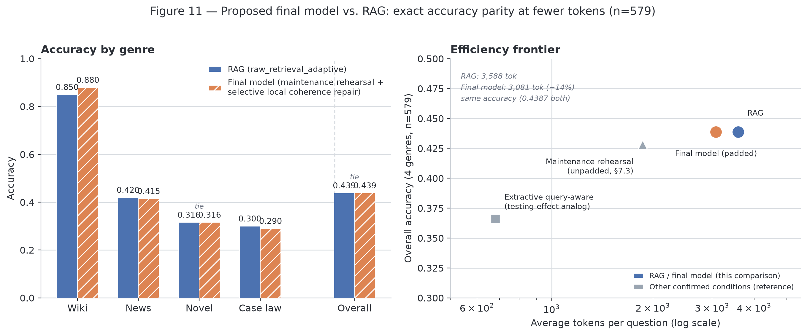

# Fit Over Depth

**Transfer-Appropriate Compression for Long-Context LLM QA**

*(repo formerly `rehearse-then-recall` — renamed once the project's headline
result moved from elaborative rehearsal to the extractive final model; see
"How we got here" below)*

## TL;DR

Human memory-consolidation strategies (rehearsal, testing effect,
reconstructive memory) are already borrowed piecemeal in LLM pipelines, but
different studies borrow different frameworks in isolation and report
inconsistent results. This project tests three of them side by side in one
long-context QA pipeline and finds the inconsistency splits cleanly into two
questions:

1. **Does the strategy work at all?** — decided by whether it *rewrites*
   content or *preserves* it. Every mechanism that regenerates text
   collapses toward near-duplicate output, independent of model scale.
2. **Given that it works, which strategy wins?** — decided by whether the
   strategy's selection grain and criterion fit the document's structure
   (Transfer-Appropriate Processing), not by a universal depth hierarchy.

The headline result: a purely extractive pipeline — verbatim sentence
selection, a compression ratio that adapts to document length, and a small
local-context repair applied only where a genre's comprehension depends on
narrative continuity — **matches a strong RAG baseline's accuracy exactly
(254/579 correct, both) while using fewer tokens on every genre tested**,
and never rewrites a single sentence. The size of that repair's effect per
genre (100% recovery for narrative, 60% for legal text) isn't fit to the
data after the fact — it's predicted in advance by a specific
text-comprehension theory (bridging inference / event-indexing).

Full account, all tables and figures: **[ANALYSIS_REPORT.md](ANALYSIS_REPORT.md)**.

<p align="center">
  
</p>
<p align="center"><sub>The proposed final model (verbatim extraction + document-length-adaptive compression + selective local coherence repair) vs. RAG — accuracy by genre (left) and the accuracy/token efficiency frontier (right). Ties RAG's overall accuracy exactly at 14% fewer tokens.</sub></p>

## How we got here

1. **Elaborative rehearsal collapses.** Combining C-DIC (arXiv:2606.12411)'s
   thread-memory retrieve/revise/write-back loop with ReadAgent
   (arXiv:2402.09727)'s gist-then-lookup strategy, a trained compressor
   rewrites each document chunk into a running "gist." At QA time this
   loses to a plain retrieval-augmented baseline with no training, no
   compression, and no teacher model anywhere — on both accuracy and token
   cost, on every genre. Root cause, confirmed independent of model size
   (t5-small student and a 70B teacher both do it): given a retrieved
   "related" thread, the model reproduces that thread near-verbatim and
   ignores the new chunk's own content — a **thread-memory collapse**.
   Since the student's training target *is* the teacher's own
   already-collapsed output, retraining the student can't fix this; the
   flaw is upstream, in teacher curation itself.
2. **Two strategies sidestep the collapse entirely** by never rewriting
   content: **extractive, query-aware sentence pruning** (a testing-effect
   analog — 5.3x fewer tokens, 34% lower latency than RAG for a modest
   accuracy cost) and **maintenance rehearsal with a document-length-adaptive
   compression ratio** (verbatim sentence selection — ties or beats RAG
   outright on the wiki genre). Which one wins is itself genre-dependent,
   consistent with Transfer-Appropriate Processing (Morris, Bransford &
   Franks, 1977) rather than a single depth-of-processing hierarchy.
3. **A small, local repair — not more rewriting — closes the remaining
   gap.** Padding each selected sentence with its immediate neighbor
   restores the "bridging" context an LLM (like a human reader) needs at a
   seam between non-adjacent sentences. Applied only where a genre's
   comprehension depends on narrative continuity, this closes the
   maintenance-rehearsal strategy's remaining gap to RAG completely on one
   genre and partially on another — in proportions a specific
   text-comprehension theory predicts, not just describes.

See **[ANALYSIS_REPORT.md](ANALYSIS_REPORT.md)** — §6 for the collapse
diagnosis, §7 for the genre-fit story and the proposed final model, §12 for
how this is framed for the paper.

## Paper / presentation links
- Paper: *"Fit Over Depth: Transfer-Appropriate Compression for
  Long-Context LLM QA"* — CUAI 9th Summer Conference short paper (final):
  [docs/paper/CUAI_하계컨퍼런스_NLP1팀_노지우_shortpaper.pdf](docs/paper/CUAI_하계컨퍼런스_NLP1팀_노지우_shortpaper.pdf)
- Presentation: [docs/paper/Fit_Over_Depth_v2.pdf](docs/paper/Fit_Over_Depth_v2.pdf) (29 slides) + speaker script
- Progress report: [ANALYSIS_REPORT.md](ANALYSIS_REPORT.md)

## Structure

```
fit-over-depth/
├── README.md
├── ANALYSIS_REPORT.md              # full results, findings, open questions
├── LICENSE
├── .gitignore
├── pyproject.toml / requirements.txt
│
├── configs/
│   ├── chunking.yaml                # chunk min/max words, semantic pagination
│   ├── curation.yaml                # stage-2 teacher curation (model, cost, doc shaping)
│   └── importance_filter.yaml       # embedding config shared across chunking/rehearsal/retrieval
│
├── data/
│   ├── raw/                         # raw data (gitignored)
│   ├── processed/                   # train/eval corpora per genre (caselaw, news, wiki, narrativeqa)
│   ├── sample/                      # eval question sets (CSV) per genre
│   └── scripts/                     # corpus builders + synthetic QA generation (per genre)
│
├── src/
│   ├── pipeline/
│   │   ├── chuncking.py             # semantic pagination into chunks
│   │   ├── rehearsal.py             # inference-time maintenance / elaborative rehearsal
│   │   ├── curation.py              # stage-2 offline curation + collapse diagnostic
│   │   ├── teacher.py               # teacher LLM API calls (curate_document, curate_document_threaded)
│   │   ├── thread_memory.py         # C-DIC's multi-slot ThreadMemory (the collapsing retrieve-and-replace mechanism)
│   │   ├── thread_grouping.py       # no-merge thread clustering — groups without ever regenerating content
│   │   ├── extractive.py            # sentence scorer + verbatim selection (windowed/no-truncation variants)
│   │   ├── embeddings.py            # NIM embedding calls + retry/rate-limit wrapper
│   │   ├── gisting.py               # sentence splitting / verbatim-snap helpers
│   │   ├── qg.py                    # question-generation input template (testing effect)
│   │   ├── rate_limit.py            # shared token-bucket rate limiter
│   │   └── types.py                 # Chunk dataclass
│   ├── eval/                        # tau sweep, maintenance-model comparison
│   └── train/                       # (reserved — training currently driven from notebooks)
│
├── experiments/                     # trained checkpoints (maintenance, elaborative stage 1/2, QG)
│
├── results/                         # QA run outputs (CSV) — one file per condition, checkpointed
│
├── notebooks/
│   ├── 00-02                        # pipeline smoke test, length-stress prep/test
│   ├── 03_qa_baseline_3conditions    # closed_book / full_context / chunked_sequential baselines
│   ├── 04-05                        # maintenance rehearsal prep + train
│   ├── 06-07                        # elaborative rehearsal stage 1 prep + train
│   ├── 06b-07b                      # elaborative rehearsal stage 2 (rolling-shaped) prep + train
│   ├── 08-09                        # question generation (testing effect) prep + train
│   ├── 10_pipeline_6conditions        # main eval notebook — name is legacy; grew from 6 to 30+
│   │                                 # conditions (rehearsal + lookup variants, RAG, gist-retrieval
│   │                                 # controls, extractive query-aware pruning, maintenance-rehearsal
│   │                                 # revival, no-merge thread clustering, soft-selection, seam-repair
│   │                                 # extensions and severity analysis, final-model figure generation)
│   └── 11_map_augmented_full_context   # full text + gist map in one call (cost-heavy, exploratory)
│
├── tests/                           # unit tests for src/pipeline
│
└── docs/
    ├── paper/                       # materials for the paper/presentation
    └── report_assets/               # figures embedded in ANALYSIS_REPORT.md
```

> Folders containing only a `.gitkeep` don't have real files yet (structure reserved in advance). Update this tree as they get filled in.
